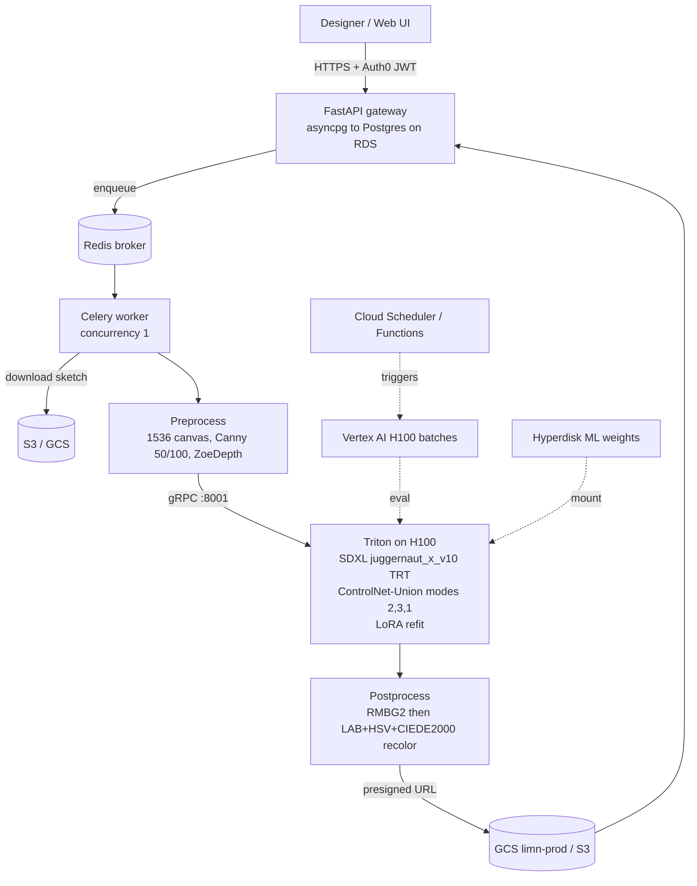

## Overview

Make The Dot is an AI apparel-design system that turns a designer's flat sketch, a target color (hex), and a text prompt into a photorealistic studio garment render in seconds. The product is called Limn internally. A designer uploads a sketch, picks an apparel category and a wash or style, and chooses a target color. The system returns a clean studio render generated by Stable Diffusion XL, conditioned by one ControlNet-Union model, and styled with a wash-specific LoRA adapter trained on curated reference data.

I owned three pieces end to end at Make The Dot: the GPU inference stack (Triton + TensorRT SDXL pipeline), the LoRA training and data pipeline, and the MLOps integration that ships new washes to production with zero downtime.

This page is both a write-up and a study guide. The top sections give a fast tour: what it does, the pipeline, and the stack. The numbered sections go deep on each subsystem: sketch ingest and control-map derivation, ControlNet-Union conditioning, SDXL+LoRA generation and refit, color correction, serving, LoRA training, evaluation, and deployment.

<div class="row">
  <div class="col-sm mt-3 mt-md-0 text-center">
    
  </div>
</div>
<div class="caption">
  Generated denim render produced from a flat sketch, a hex color, and a wash specification.
</div>

## Why It Exists

Apparel teams need to test many visual directions from the same silhouette under tight timeline pressure. Manual redraw and physical photo sampling loops are expensive, slow, and hard to scale across categories and wash variants. The system preserves designer control from the sketch input and reduces iteration from days to seconds. The same flat sketch can drive an entire collection of washes without redrawing.

## What it does, in five steps

1. **Ingest the sketch.** The GPU worker downloads the sketch, scales it to a 1536x1536 white canvas, and derives the control maps server-side so the client never precomputes anything.
2. **Condition generation.** Three control images (scribble, Canny, depth) feed one ControlNet-Union model in a single forward pass, with per-modality scales `[0.3, 0.25, 0.6]`.
3. **Generate.** SDXL (`juggernaut_x_v10`) runs as a TensorRT engine inside Triton at 1536x1536, 30 steps, guidance 5.0, Euler scheduler, with the selected wash LoRA refit into the engine.
4. **Recolor and clean up.** RMBG2 removes the background for a white studio plate, then a multi-stage LAB+HSV+CIEDE2000 pipeline nudges the wash toward the target hex.
5. **Return.** The render uploads to GCS and S3, and the gateway returns a presigned URL (1-hour expiry).

## The render pipeline at a glance

The worker's `process()` runs eight stages with explicit progress checkpoints:

```
DOWNLOAD (10%) → PREPROCESS (20%) → CANNY (25%) → DEPTH (30%) →
GENERATE (50%) → RMBG (70%) → RECOLOR (85%) → UPLOAD (95%) → COMPLETE (100%)
```

The same path as an architecture flow, with the side systems that feed it:



## Stack at a glance

| Layer             | Technology                                                                                                                      |
| ----------------- | ------------------------------------------------------------------------------------------------------------------------------- |
| Base model        | Stable Diffusion XL fine-tune `juggernaut_x_v10`, pipeline type XL_CONTROLNET                                                   |
| Conditioning      | ControlNet-Union SDXL (`xinsir/controlnet-union-sdxl-1.0`), control modes `[2, 3, 1]`                                           |
| Control maps      | `controlnet_aux.CannyDetector` (50/100), ZoeDepth (`lllyasviel/Annotators`)                                                     |
| Fine tuning       | HuggingFace Diffusers LoRA trainer, 9 denim wash adapters plus per-category LoRAs                                               |
| Inference serving | NVIDIA Triton 25.11 (Python backend), TensorRT 10.14, NVIDIA `demo_diffusion` SDXL pipeline, CUDA 12.4                          |
| Postprocess       | RMBG2 (Triton + local ONNX fallback), `kornia` GPU color correction                                                             |
| Hardware          | NVIDIA H100 80GB on GCP a3-highgpu machines, single-GPU inference                                                               |
| API               | FastAPI gateway, Auth0 + JWT (RS256 via JWKS), asyncpg, PostgreSQL on AWS RDS                                                   |
| Async / queue     | Celery (concurrency 1), Redis (GCP Memorystore)                                                                                 |
| Infra             | GKE, Google Artifact Registry, Hyperdisk ML, Vertex AI custom jobs, Cloud Scheduler, Cloud Functions, AWS S3, GCS (`limn-prod`) |
| Eval / data       | Mass-testing harness with HTML A/B diff reports, GPT-4 Vision captioning, custom scrapers, rembg                                |

## Live + Code

📂 [github.com/hengfranklin/fashion-stable-diffusion](https://github.com/hengfranklin/fashion-stable-diffusion) (public showcase README; source code is proprietary)

---

## 1. Sketch ingest and control-map derivation

The client uploads one flat sketch. Everything downstream is derived server-side, so the integration stays thin and the control maps stay consistent across categories.

<div class="row">
  <div class="col-sm mt-3 mt-md-0 text-center">
    
  </div>
  <div class="col-sm mt-3 mt-md-0 text-center">
    
  </div>
</div>
<div class="caption">
  <b>Input A</b>: pants sketch used for conditional generation. <b>Input B</b>: polo sketch used for conditional generation. Both are flat line drawings; the worker handles all resizing and control-map extraction.
</div>

### 1.1 Canvas preparation

`prepare_sketch_numpy` scales the longest side to 1536 px (`scale = 1536 / max(w, h)`) with LANCZOS4 interpolation, then center-pads onto a 1536x1536 white (255) RGB canvas. RGBA inputs are flattened over white first, so transparent sketches do not introduce black edges.

### 1.2 The two derived control maps

| Control map | Producer                                                       | Settings                                 |
| ----------- | -------------------------------------------------------------- | ---------------------------------------- |
| Canny edges | `controlnet_aux.CannyDetector`                                 | `low_threshold=50`, `high_threshold=100` |
| Depth       | `ZoeDetector.from_pretrained("lllyasviel/Annotators")` on CUDA | `output_type="np"`                       |

The original sketch itself is the third control image (used as the scribble modality). The worker hands all three to the GPU pipeline as UINT8 tensors of shape `[1, H, W, C]`.

---

## 2. ControlNet-Union conditioning

One ControlNet model handles all three control signals in a single forward pass, instead of stacking three separate ControlNets. This is the single biggest VRAM and latency win in the conditioning stage.

<div class="row">
  <div class="col-sm mt-3 mt-md-0 text-center">
    
  </div>
</div>
<div class="caption">
  Canny edge map derived from a sketch. This is one of the three conditioning inputs sent to the ControlNet-Union model.
</div>

### 2.1 The three modalities and their scales

The three control images are sent over gRPC as `controlnet_image_0/1/2` in the order sketch (scribble), Canny, depth. Each modality has its own conditioning scale.

| Slot | Modality                  | Control mode | Default scale |
| ---- | ------------------------- | ------------ | ------------- |
| 0    | Scribble (the raw sketch) | 2            | 0.30          |
| 1    | Canny edges               | 3            | 0.25          |
| 2    | Depth                     | 1            | 0.60          |

The per-modality scales default to `[0.3, 0.25, 0.6]` (`CONTROLNET_SCALES` env default `'0.3,0.25,0.6'`, with the same hardcoded fallback in `ImageGenerator`). Depth carries the most weight, since the garment's 3D form drives the realism of the render, while the scribble and Canny keep the silhouette honest to the sketch.

### 2.2 Union control modes

The code sets `self._control_modes = [2, 3, 1]` with the in-code comment `2=scribble, 3=canny, 1=depth`, and `self._max_controlnets_num = 3`. ControlNet-Union is a single unified ControlNet that supports 10+ control conditions through a shared condition encoder, so it needs no extra parameters or per-condition tuning to take all three at once. `_process_batch` passes one image list plus `control_modes` to `self._pipeline.infer(...)`, confirming the single forward pass.

---

## 3. SDXL + LoRA generation and TensorRT refit

The diffusion model runs as a Triton Python backend (`TritonPythonModel.execute()`) built on NVIDIA's TensorRT SDXL demo pipeline (`demo_diffusion`). This is the real serving stack, not a stock Diffusers loop.

### 3.1 Generation parameters

| Parameter          | Value                                            |
| ------------------ | ------------------------------------------------ |
| Base model         | `juggernaut_x_v10` (pipeline type XL_CONTROLNET) |
| Resolution         | 1536 x 1536                                      |
| Steps              | 30                                               |
| Guidance scale     | 5.0                                              |
| Scheduler          | Euler                                            |
| Image strength     | 0.3                                              |
| VAE scaling factor | 0.13025                                          |
| ONNX opset         | 21                                               |

### 3.2 TensorRT engine configuration

The engine is built with CUDA graphs, refit enabled, the highest optimization level, and a small LoRA cache.

| Setting               | Value |
| --------------------- | ----- |
| `_use_cuda_graph`     | True  |
| `_enable_refit`       | True  |
| `_optimization_level` | 5     |
| `_enable_all_tactics` | True  |
| `_lora_cache_size`    | 5     |

The pipeline uses FP16 precision, consistent with the `demo_diffusion` default and the documented tech stack.

### 3.3 LoRA application and refit-on-change

LoRA adapters live at `/mtd/trained-loras/{file}.safetensors`. The default LoRA weight is 0.4 (`LORA_WEIGHT` env default; `_lora_weight = [0.4]`) with `_lora_scale = 1.0`. Refit mapping files bake the weight and scale into the filename, for example `refit-<md5>-0.40-1.00.json`.

The mechanism behind "LoRA updates in seconds" is `_update_lora_if_needed()`. It compares the requested paths, weights, and scale against the loaded ones. If anything changed, it updates `SDLoraLoader` and then calls `self._pipeline.refitUpdatedLoRA(self.engine_dir, self.onnx_dir)`. The LoRA is refit into the U-Net of the already-built engine, so swapping a wash does not trigger an engine rebuild.

There are two LoRA paths. `generate()` applies a single adapter. `generate_multiple()` requires at least two files and blends them; on failure it falls back to the single-LoRA path (a verified try/except in `worker._generate_image`).

### 3.4 Category and multi-LoRA recipes

`loras.json` maps apparel categories to adapter files: 22 Womenswear entries and 10 Menswear entries (for example `mtd_womenswear_pajamatops_10_model_last.safetensors`, `mtd_menswear_polos0306_10_model_last.safetensors`). `loras_processed.json` and `loras_refit_mapping.json` map each to its refit JSON and md5.

Multi-LoRA blend recipes combine wash adapters at inference time to create new variations without retraining. Two verified recipes:

| Blend               | Recipe                                                     |
| ------------------- | ---------------------------------------------------------- |
| `faded-wash`        | `mtd_denim_light_wash` @0.4 + `mtd_denim_bleach_wash` @0.4 |
| `bleach-stone-wash` | `mtd_denim_bleach_wash` @0.4 + `mtd_denim_stone_wash` @0.4 |

<div class="row">
  <div class="col-sm mt-3 mt-md-0 text-center">
    
  </div>
  <div class="col-sm mt-3 mt-md-0 text-center">
    
  </div>
  <div class="col-sm mt-3 mt-md-0 text-center">
    
  </div>
  <div class="col-sm mt-3 mt-md-0 text-center">
    
  </div>
</div>
<div class="caption">
  <b>Light</b>, <b>medium</b>, <b>dark</b>, and <b>black</b> wash LoRAs applied to the same pants sketch. One silhouette, four washes, generated by the same pipeline through engine refit.
</div>

---

## 4. Color correction

This is the most under-told piece of engineering in the system. After RMBG2 produces a clean white plate, a multi-stage GPU pipeline (using `kornia`) nudges the generated wash toward the target hex while keeping fabric texture and shading intact. `ColorCorrection.adjust_color_to_target` runs seven steps.

1. Convert the target hex to RGB, then to LAB.
2. Run `iterative_lab_correction` (default `max_iterations=5`, `convergence_threshold=1.0`). Near-black pixels (`L < 5`) are excluded. Each iteration applies `dL*0.2, da*0.8, db*0.8` with a decaying `factor = 0.8 * (1 - i/max)` and an `l_weight = 0.2`.
3. Run `single_lab_pass`, a full a/b channel replacement that preserves L.
4. Merge iterative and single results at 0.4 : 0.6.
5. Run `simple_hsv_pass`, replacing hue and saturation while preserving value.
6. Merge the LAB and HSV results at 0.6 (LAB) + 0.4 (HSV).
7. Run `ciede2000_distance_merge`: a weighted Delta-E (`0.2*dL^2 + da^2 + db^2`) combined with a LAB 4096-bin color-rarity histogram, blended through a sigmoid with the merge alpha clamped to [0.2, 0.8].

The near-black exclusion keeps shadows and seams from being recolored, and the histogram rarity weighting protects rare highlight tones from being flattened. There is also a `gamma_correct` step (luminance-matched gamma, clamped 0.33-3) used in the R&D Stable Diffusion 3.5 path.

The corrected render uploads to GCS (`limn-prod`, prefix `PICTURES`) and S3 (`mtd-stylebuilder-sketch`), each returning a presigned URL with a 1-hour (3600s) expiry.

---

## 5. Serving: Triton, Celery, and the gateway

### 5.1 Triton over gRPC

The diffusion model is a Triton Python backend served over gRPC (`tritonclient.grpc`) on port 8001 (HTTP on 8080). The output tensor is `generated_image` (UINT8). RMBG2 is also a Triton model (`rmbg2`) over gRPC, with a local ONNX fallback at `/mtd/models/rmbg2/1/model.onnx` (onnxruntime, CUDA provider) so background removal still runs if the Triton model is unavailable.

### 5.2 Celery and Redis

A Celery worker runs the eight-stage pipeline with `CELERY_CONCURRENCY=1` (one render at a time per worker, since each render saturates the GPU), a 300s hard task time limit (240s soft), and `MAX_RETRIES=2`. Redis is the broker (DB 0) and the result backend (DB 1). A health-check manager polls Triton.

### 5.3 FastAPI gateway

The gateway authenticates with Auth0 JWTs (RS256 via JWKS, `PyJWKClient` against `https://{AUTH0_DOMAIN}/.well-known/jwks.json`), holds an asyncpg pool to Postgres on RDS, and enqueues jobs to Celery. Request payloads carry an idempotency field and Pydantic models expose `multiple_loras: List[str]` and `lora_weights: List[float]` for multi-LoRA jobs. Health is exposed at `/health/live` and `/health/ready`.

---

## 6. LoRA training and the data pipeline

New washes are produced by owning the full loop: scrape, curate, caption, train, validate, and roll out.

- **Data tooling:** modular vendor scrapers (Mood Fabrics, Britex), background removal with rembg, and Gradio + SerpAPI reverse-image-search apps for curation.
- **Captioning:** GPT-4 Vision generates captions for the training images.
- **Training:** a HuggingFace Diffusers LoRA trainer (notebook-based, `lora-finetuning/data_preparation.ipynb`). Dataset folders follow the kohya-style convention `10_<wash>`, where 10 is the per-image repeat count.
- **Coverage:** nine denim wash training directories exist (`acid` plus `acid_v2`, `bleach`, `dark`, `light`, `purple`, `rinse`, `stone`, `vintage_aged`), confirming the 8+ wash-specific adapters, alongside the per-category LoRAs in `loras.json`.

The specific training hyperparameters (rank, alpha, steps, learning rate) live in the training notebook and are not reported here.

<div class="row">
  <div class="col-sm mt-3 mt-md-0 text-center">
    
  </div>
  <div class="col-sm mt-3 mt-md-0 text-center">
    
  </div>
</div>
<div class="caption">
  The pipeline generalizes beyond denim. <b>Polo</b>: generated menswear output. <b>Pajama top</b>: generated womenswear output. Both come from a flat sketch and a category LoRA.
</div>

---

## 7. Evaluation: the mass-testing harness

The harness converts subjective pipeline comparison into a reproducible side-by-side report. It runs a matrix of categories, sketches, colors, renders, and environments against the live API, then builds HTML A/B diff reports for promotion decisions.

- The README headline is a 560-task run. A second matrix comment in `test_config.yaml` computes `7 categories x 4 sketches x 10 colors x 3 renders x 2 envs = 1680`. Both numbers exist in the repo, depending on the matrix dimensions chosen.
- The pipelines compared default to `['current', 'new']`, so a new LoRA or pipeline change is graded against the live one.
- GPT-4 Vision analyzes sketches and builds enhanced prompts in `task_generator.py`.
- `report_generator.py` produces the HTML A/B diff reports.

Updated washes are re-curated with tighter filtering, better captions, and more consistent lighting, then validated through these side-by-side runs before promotion.

---

## 8. Deployment and zero-downtime rollout

The inference service deploys to GKE (`limn-h100-deployment.yaml`, `replicas: 1`, image `us-central1-docker.pkg.dev/optimal-life-424422-u8/limn-registry/limn-h100:v1.0.0`, `nvidia.com/gpu: 1`, with a GPU taint and matching toleration). Model weights mount from Hyperdisk ML; the gpu-docs cite a provisioned throughput of 23760 MB/s for that volume, the one concrete performance figure in the repo.

Shipping a new wash does not require taking the service down. A new LoRA is processed on dedicated H100 capacity, staged on Hyperdisk ML, and hot-swapped into the engine via TensorRT refit rather than an engine rebuild. Burst evaluation runs on a Vertex AI custom job (`machine_type="a3-highgpu-8g"`, `accelerator_type="NVIDIA_H100_80GB"`, `accelerator_count=1`, `replica_count=1`), so evaluation does not keep an inference cluster scaled up. Cloud Scheduler and Cloud Functions provide cron and HTTP triggers.

### Production engineering highlights

- **ControlNet-Union refactor:** replaced the old multi-image client API with a single sketch input; the server derives scribble, Canny, and ZoeDepth maps and feeds one ControlNet-Union model.
- **TensorRT refit, not rebuild:** LoRA swaps go through `refitUpdatedLoRA`, cutting wash updates from multi-minute engine rebuilds to seconds.
- **Multi-LoRA blending:** config-driven recipes combine wash adapters at inference (for example `faded-wash = light @0.4 + bleach @0.4`) without retraining.
- **Triton Python backend serving:** the full diffusion pipeline wrapped as a Triton model for gRPC serving, health checks, versioning, and instance grouping.
- **FastAPI gateway:** Auth0 + JWT (RS256), asyncpg with Postgres on RDS, Celery + Redis queueing, idempotency, and presigned S3/GCS result URLs.
- **A/B harness:** the mass-testing matrix turns pipeline comparison into an HTML side-by-side report for promotion decisions.

## Honest limits

Inference latency, throughput, and images-per-second are not publicly reportable; no benchmark numbers exist in the codebase beyond the qualitative "in seconds" and the Hyperdisk storage throughput above. Catalog-growth and iteration-time claims are real but qualitative, with no quantitative backing attached here. LoRA training hyperparameters live in a notebook and are not reported.

## Related Sources

- ControlNet-Union SDXL (`xinsir/controlnet-union-sdxl-1.0`, [HuggingFace](https://huggingface.co/xinsir/controlnet-union-sdxl-1.0), [ControlNetPlus](https://github.com/xinsir6/ControlNetPlus)): the single unified ControlNet used for scribble, canny, and depth in one forward pass.
- SDXL and Juggernaut-X-v10 (RunDiffusion): the SDXL fine-tune used as the base generation model.
- LoRA (Hu et al. 2021) and HuggingFace Diffusers: low-rank adapters and the trainer used to produce the wash-specific adapters.
- NVIDIA Triton Inference Server and TensorRT, including the `demo_diffusion` SDXL TRT demo: the serving and engine stack that the pipeline is built on.
- ZoeDepth (Intel ISL, via `lllyasviel/Annotators`): the depth estimator for the depth control map.
- RMBG-2.0 (BRIA): the background-removal model for the white studio plate.
- kornia: the GPU library backing the LAB, HSV, and CIEDE2000 color-correction passes.
