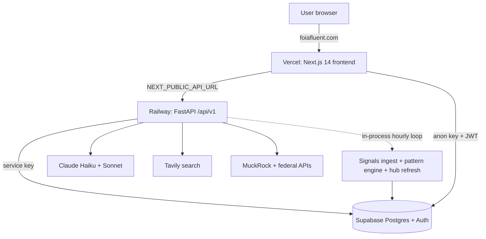

## Overview

FOIA Fluent is an open-source civic AI platform for journalists, lawyers, researchers, and citizens. It covers the full FOIA lifecycle: discover existing records, draft a statute-grounded request, track it through the agency's response, analyze the response, and surface cross-agency patterns from a live federal signals feed. We built it with NYC Data Science for Social Good.

The codebase is a FastAPI backend and a Next.js 14 frontend. Supabase handles persistence and auth. Claude does the language work, on two models: `claude-haiku-4-5-20251001` for cheap bounded tasks and `claude-sonnet-4-6` for the heavy reasoning. A registry-driven ingest pipeline pulls from 19 federal sources and an LLM pattern engine reads the resulting corpus.

This page is both a project write-up and a study guide. The top sections give a fast tour. The later sections go deep on every subsystem: the discover-and-draft pipeline, the signals ingest, the pattern engine, the chat assistant, the Transparency Hub, the Supabase data model, hosting, and costs.

<div class="row">
  <div class="col-sm mt-3 mt-md-0 text-center">
    
  </div>
</div>
<div class="caption">
  Homepage: entry to Discover & Draft, the Transparency Hub, Live FOIA Signals, My Requests, and the chat assistant.
</div>

## Live + Code

🔗 [www.foiafluent.com](https://www.foiafluent.com) · 📂 [github.com/dssg-nyc/FOIA-Fluent](https://github.com/dssg-nyc/FOIA-Fluent)

## The five things FOIA Fluent does

1. **Discover & Draft.** You type a plain-English question. The system interprets intent, searches MuckRock, DocumentCloud, and the open web in parallel, identifies the right agency, then drafts a FOIA letter grounded in the verbatim statute, the agency's eCFR regulation text, and real outcome data.
2. **Track & Analyze.** Each request is tracked with a 20-business-day deadline calculator, a communication log, and Claude-driven analysis of agency responses, including appeal and follow-up letter generation. Requests filed elsewhere can be imported and graded against the same research context. Saved documents and saved searches persist in a per-user research library.
3. **Live FOIA Signals.** A registry of 19 federal sources is ingested daily. Each item is summarized and tagged by Claude. Entities are resolved to slugs so signals link to one another.
4. **Pattern Engine.** A Claude Sonnet job reads the most recent 400 signals and detects cross-source patterns across 7 pattern types, with anti-hallucination grounding so every claim traces to a cited signal.
5. **Chat Assistant.** A tool-using assistant with 11 read-only tools and a 4-tier accuracy ladder. It answers from verified local data first, then trusted web search, then escalates the model only when needed.

## System architecture at a glance

```
            foiafluent.com (custom domain, Vercel dashboard)
                              │
                              ▼
                ┌─────────────────────────────┐
                │  Vercel: Next.js 14 frontend │  (App Router, mostly client components)
                │  project "foia-fluent"       │
                └─────────────────────────────┘
                      │                        │
   NEXT_PUBLIC_API_URL│                        │ NEXT_PUBLIC_SUPABASE_URL
                      ▼                        ▼
       ┌──────────────────────────┐   ┌────────────────────────┐
       │ Railway: FastAPI backend │   │ Supabase (Postgres +    │
       │ uvicorn app.main:app     │   │ Auth + RLS)             │
       │ /api/v1/* (11 routers)   │   │ data + JWT auth         │
       └──────────────────────────┘   └────────────────────────┘
          │            │          │            ▲
          ▼            ▼          ▼            │ service-key writes
     ┌─────────┐  ┌─────────┐ ┌─────────┐      │
     │ Claude  │  │ Tavily  │ │ MuckRock│──────┘
     │ Haiku + │  │ web/doc │ │ + many  │
     │ Sonnet  │  │ search  │ │ fed APIs│
     └─────────┘  └─────────┘ └─────────┘
```

The frontend calls the backend at `NEXT_PUBLIC_API_URL`. The backend talks to Claude, Tavily, MuckRock, and a set of federal APIs, and reads/writes Supabase with the service-role key. An in-process hourly loop inside the backend runs the signals ingest and the scheduled hub refreshes, so no separate cron service is needed.

The same picture as a flow diagram:



## Stack at a glance

| Layer            | Technology                                                                                |
| ---------------- | ----------------------------------------------------------------------------------------- |
| Frontend         | Next.js 14.2.29 (App Router), React 18, TypeScript, recharts, react-simple-maps, d3-force |
| Frontend hosting | Vercel (project `foia-fluent`, framework `nextjs`)                                        |
| Backend          | FastAPI 0.115.12, uvicorn, httpx, pydantic 2                                              |
| Backend hosting  | Railway (nixpacks builder, healthcheck `/health`)                                         |
| Database + auth  | Supabase (Postgres, Row Level Security, Supabase Auth email OTP)                          |
| LLM              | Claude `claude-haiku-4-5-20251001` and `claude-sonnet-4-6` (Anthropic API)                |
| Search           | Tavily (web, documents, public records), MuckRock REST + domain-scoped Tavily             |
| Federal data     | openFDA, NHTSA, CPSC, Congress.gov, Regulations.gov, FEC, GAO, EPA ECHO, FOIA.gov         |

---

## 1. Discover & Draft pipeline

This is the flagship request-creation flow. It turns a plain-English query into a discovery report and a fully drafted, statute-grounded FOIA letter.

<div class="row">
  <div class="col-sm mt-3 mt-md-0 text-center">
    
  </div>
</div>
<div class="caption">
  Discover & Draft: discovery results in the left and center panes, the drafted letter and "How We Built This Draft" interpretability panel in review.
</div>

### 1.1 The pipeline

```
free-text query
   │
   ▼
[0] QueryInterpreter (Claude Haiku, JSON only)
   │   → intent, foia_queries, document_queries, public_records_queries, agencies, record_types
   ▼
[1] parallel asyncio.gather
   ├── Task A: identify_agency (Claude Haiku)  → primary agency + alternatives, from a fixed list
   └── Task B: public documents (DocumentCloud + Tavily public records)
   │
   ▼  (if a primary agency was found)
[2] research_similar_requests (Tavily, scoped to muckrock.com)
   │
   ▼
[3] unify + dedupe results → DiscoveryStep 1 (similar requests), Step 2 (public docs)
   │
   ▼
[4] generate_draft (Claude Sonnet, 8000 max_tokens)
   │   three grounding layers + anti-hallucination rules
   ▼
letter_text + drafting_strategy + key_elements + tips + submission_info
```

### 1.2 Query interpretation

`QueryInterpreter.interpret()` runs `claude-haiku-4-5-20251001` at `max_tokens=1000`. Haiku is used since this is intent classification and query rewriting with no reasoning depth required. The model returns valid JSON only, with these fields:

| Field                    | Meaning                                                   |
| ------------------------ | --------------------------------------------------------- |
| `intent`                 | Human-readable explanation of the search strategy         |
| `foia_queries`           | 2-3 queries optimized for muckrock.com, different angles  |
| `document_queries`       | Queries optimized for documentcloud.org                   |
| `public_records_queries` | Queries for public government data, reports, and policies |
| `agencies`               | Agencies likely to hold the records                       |
| `record_types`           | Types of records to look for                              |

On a parse failure the fallback returns the raw query in each field, so the pipeline never hard-fails.

### 1.3 Parallel multi-source search

Two tasks run together. Task A identifies the agency. `FOIADrafter.identify_agency` runs Haiku at `max_tokens=1000` with an anti-hallucination prompt: it may only recommend agencies from a fixed in-code list, prefers the specific sub-agency over the parent (ICE over DHS, FBI over DOJ, FDA over HHS), and never refuses. Task B fetches public documents: DocumentCloud via its search API (`per_page=10`, capped at 25) and Tavily public-records search across a fixed allow-list of domains (`data.gov`, `ice.gov`, `dhs.gov`, `justice.gov`, `foia.gov`, `aclu.org`, `propublica.org`, `reuters.com`).

After both finish, if a primary agency was found, the pipeline runs an agency-scoped similar-request search through Tavily, scoped to `muckrock.com`. Note that MuckRock outcome data flows in through Tavily domain-scoping, not the direct MuckRock REST client. Results are deduped by normalized URL.

### 1.4 The drafter and its three grounding layers

`FOIADrafter.generate_draft()` runs `claude-sonnet-4-6` at `max_tokens=8000`. The 8K ceiling exists since the letter plus the five-field drafting strategy plus key elements, tips, and submission info routinely exceeds 3K. If the model stops on `max_tokens`, the code raises an error rather than returning truncated JSON.

The prompt assembles three verified grounding layers so the model never invents legal authority:

| Layer                            | Source                                                                                    | What it grounds                                                  |
| -------------------------------- | ----------------------------------------------------------------------------------------- | ---------------------------------------------------------------- |
| 1. Statute text                  | Hardcoded `FOIA_STATUTE` dict (from uscode.house.gov, Office of the Law Revision Counsel) | Verbatim 5 U.S.C. 552 sections and exemptions b1-b9              |
| 2. eCFR regulation text          | `cfr_text` field on the agency profile (from eCFR, seeded into Supabase)                  | The agency's own FOIA procedures, deadlines, and fee schedules   |
| 3. MuckRock outcome intelligence | Tavily domain-scoped searches + the `AgencyIntelAgent`                                    | Successful request patterns, denial patterns, exemption patterns |

The anti-hallucination rules are explicit. Claude may only cite statutes and regulations present in the verified context. It must not cite anything from training data, must not invent addresses or office names, and must say so if the context lacks a relevant citation rather than guessing.

The drafter returns an interpretability object called `drafting_strategy` with exactly five fields, surfaced in the UI as "How We Built This Draft": `summary`, `learned_from_successes`, `avoided_from_denials`, `scope_decisions`, and `exemption_awareness`. The top-level draft JSON also returns `letter_text`, `statute_cited`, `key_elements`, `tips`, and `submission_info`.

### 1.5 Agency intel agent

`AgencyIntelAgent.research_agency` runs three parallel Tavily searches scoped to `muckrock.com`: one for denied/rejected requests, one for completed/fulfilled requests, and one for exemption/withheld/redacted patterns (`max_results=8`, advanced depth). Results are cached for 24 hours, Supabase-first in `agency_intel_cache`, then a local JSON mirror. The cached payload buckets into success, denial, and exemption patterns.

### 1.6 Tracking, deadlines, and response analysis

Once a request is tracked, the deadline calculator implements the 20 business days under 5 U.S.C. 552(a)(6)(A), skipping weekends and a hardcoded set of federal holidays for 2025-2027 (with observed-date shifts). It returns elapsed days, remaining days, an overdue flag, and a status label like "Day 7 of 20" or "OVERDUE by 3 business day(s)".

When an agency responds, the response analyzer runs `claude-sonnet-4-6` at `max_tokens=2000`. It supports multimodal attachments (PDF, images, DOCX, TXT, HTML, TIFF converted via Pillow) and prior communication history. It returns `response_complete`, `exemptions_cited`, `exemptions_valid` (each with assessment and reasoning), `missing_records`, `grounds_for_appeal`, `recommended_action` (accept, follow_up, appeal, negotiate_scope), and a plain-language summary. The recommended action drives the request status.

Letter generation has two paths: follow-up letters use Haiku at `max_tokens=2000` (formulaic reminders), and appeal letters use Sonnet at `max_tokens=2500` (they challenge each exemption with its statutory text).

### 1.7 My Discoveries: the saved-document library

Every result from a discovery search can be saved into a per-user library, labeled in the code as Discover & Draft Phase 3 and backed by the `discovered_documents` table. A save is a `POST /api/v1/discoveries` carrying the document's `source` (`muckrock`, `documentcloud`, or `web`), `title`, `url`, `agency`, optional `page_count` and `document_date`, the `discovered_via_query` that surfaced it, plus `tags` and a `note`.

Saving is idempotent on the `(user_id, url)` pair. The service inserts first, and on the unique-constraint collision it returns the existing row rather than erroring, so the same document never duplicates in a user's library. Each document then moves through a small lifecycle with `PATCH /api/v1/discoveries/{id}`: `status` runs `saved` then `reviewed` then `useful` or `not_useful`, and `note`, `tags`, and `tracked_request_id` are editable. Setting `tracked_request_id` links a saved document to a filed request, so the research and the filing live next to each other. The list endpoint filters by status, tag, linked request, or free-text query and caps at 500 rows.

The chat assistant reads this library directly. `search_my_discoveries` queries it, and `read_saved_document` fetches one saved document and pulls its full live text through Tavily extract.

### 1.8 Saved Searches

A discovery query can itself be saved and reopened, labeled Phase 4 and backed by the `saved_searches` table. Saved searches appear in the left sidebar's recent list, so a researcher can jump back into a prior query from any page.

A save is idempotent on the normalized query, which we trim and lowercase before matching. Re-saving the same query updates `last_run_at`, `last_result_count`, the cached AI `interpretation`, and an optional `result_snapshot`, rather than creating a second row. The `result_snapshot` holds the entire `DiscoveryResponse` from the last run with a `snapshot_at` timestamp, so clicking a saved search hydrates the three-pane view instantly without re-running the Claude, DocumentCloud, and Tavily pipeline. A "Refresh" action re-runs the pipeline and overwrites the snapshot. The list endpoint (`GET /api/v1/saved-searches`, ordered by `last_run_at`) strips the heavy `result_snapshot` column to keep the sidebar light, and the single-row `GET /api/v1/saved-searches/{id}` is the only path that returns it.

### 1.9 Importing an existing request

A request filed somewhere else can be brought in for the full research treatment through `POST /api/v1/tracking/requests/import`, carrying the `letter_text`, an `agency_abbreviation`, a `description`, and optionally a `filed_date` and an `existing_response`.

The import runs the same research pipeline as the drafter, similar MuckRock requests plus agency intel plus the verified statute and the agency's eCFR text, but instead of writing a letter it grades the letter you already have. `RequestAnalyzer.analyze_import` returns a `DraftingStrategy`, the same five-field shape as the drafter's output, surfaced on the request detail page as "Analysis of Your Request" rather than "How We Built This Draft". The same anti-hallucination rules apply: exemption risk is assessed only against the verified statute, and agency contacts are never invented. If an `existing_response` is supplied, the response analyzer runs immediately, so an imported request lands already analyzed. The initial status is derived from `filed_date`: `draft` when unfiled, `awaiting_response` when filed without a reply, and `responded` when a reply is attached. The endpoint returns a `TrackedRequestDetail`, the same shape as creating a request, so the UI navigates straight to the detail page.

### 1.10 Model and cost summary for this pipeline

| Flow                         | Model      | max_tokens | Approx vendor cost/call |
| ---------------------------- | ---------- | ---------- | ----------------------- |
| Query interpretation         | Haiku 4.5  | 1000       | ~$0.008                 |
| Agency identification        | Haiku 4.5  | 1000       | ~$0.011                 |
| Letter drafting              | Sonnet 4.6 | 8000       | ~$0.060                 |
| Response analysis (text)     | Sonnet 4.6 | 2000       | ~$0.035                 |
| Response analysis (with PDF) | Sonnet 4.6 | 2000       | ~$0.090                 |
| Follow-up letter             | Haiku 4.5  | 2000       | ~$0.029                 |
| Appeal letter                | Sonnet 4.6 | 2500       | ~$0.039                 |

A full round trip of search, draft, file, analyze, and appeal costs roughly `$0.16` per request in vendor spend.

---

## 2. Live FOIA Signals: the ingest engine

The signals system pulls fresh federal activity from 19 sources every day, runs each item through Claude for structured extraction, and stores normalized signals that link to one another by entity.

<div class="row">
  <div class="col-sm mt-3 mt-md-0 text-center">
    
  </div>
</div>
<div class="caption">
  Live FOIA Signals: the aggregated feed of federal enforcement, recalls, oversight reports, court opinions, and FOIA-log entries, filterable by persona and entity.
</div>

### 2.1 The ingest pipeline

```
hourly in-process loop (SIGNALS_DISPATCH_TICK_SECONDS = 3600)
   │   30s warm-up, then run_due_sources() every hour
   ▼
for each source in enabled_sources():
   │   self-gating: skip if elapsed < cadence_minutes  → "skipped_cadence"
   ▼
fetch(cfg) via one of 5 strategies (rss, html, json_api, csv_bulk, pdf_vision)
   │   cap items[:max_items_per_run], 0.15s pacing between items
   ▼
per item: Claude Haiku extract_signal (forced tool use, 800 max_tokens)
   │   → summary, entities, category_tags, priority (0-2), requester
   ▼
category_tags = Claude picks ∪ SOURCE_DEFAULT_CATEGORIES[source]
persona_tags  = derive_persona_tags(category_tags)
entity_slugs  = build_entity_slugs(entities, requester)  → "type:slug"
   ▼
insert into foia_signals_feed (UNIQUE(source, source_id) dedup)
   │
   ▼  if total_inserted > 0
maybe_run_pattern_detection()  (12h debounce)
   ▼
run_due_scheduled_jobs()  (weekly hub stats refreshes)
```

### 2.2 The source registry

The registry is a single Python file, `signals_sources.py`, holding a module-level `SOURCES` dict of `SourceConfig` entries. Adding a source means adding one entry. There are no per-source cron jobs or scripts. The new source automatically flows into the hourly dispatcher, the health dashboard, the per-source counts, and the default-category map.

`SourceConfig` is a frozen dataclass with these fields: `source_id`, `label`, `family`, `fetch_strategy`, `fetch_config` (a dict holding the URL and selectors), `cadence_minutes`, plus defaults `agency_codes`, `lookback_days=21`, `max_items_per_run=200`, `max_claude_calls_per_day=300`, and `enabled=True`. There is no per-source `priority` or `category`: priority is extracted per signal by Claude (0-2), and categories come from the default map plus Claude's picks.

The registry holds 19 sources, all enabled, all on a 1440-minute (daily) cadence:

| #   | source_id                | label                                       | family      | strategy   | agency   | max items/run |
| --- | ------------------------ | ------------------------------------------- | ----------- | ---------- | -------- | ------------- |
| 1   | `gao_protests`           | GAO Bid Protest Decision (via legal blogs)  | enforcement | rss        | GAO      | 200           |
| 2   | `epa_echo`               | EPA ECHO Enforcement Action                 | enforcement | csv_bulk   | EPA      | 200           |
| 3   | `fda_warning_letters`    | FDA Warning Letter                          | enforcement | html       | FDA      | 50            |
| 4   | `dhs_foia_log`           | DHS FOIA Log Entry                          | research    | pdf_vision | DHS      | 6             |
| 5   | `oversight_ig_reports`   | Federal Inspector General Report            | enforcement | rss        | (none)   | 100           |
| 6   | `gao_reports`            | GAO Report (audits, evaluations, testimony) | research    | rss        | GAO      | 100           |
| 7   | `osha_news`              | OSHA news release                           | enforcement | rss        | OSHA     | 100           |
| 8   | `irs_news`               | IRS news release                            | enforcement | html       | IRS      | 40            |
| 9   | `fda_drug_recalls`       | FDA Drug Recall (openFDA)                   | recalls     | json_api   | FDA      | 100           |
| 10  | `fda_food_recalls`       | FDA Food/Cosmetic Recall (openFDA)          | recalls     | json_api   | FDA      | 100           |
| 11  | `fda_device_recalls`     | FDA Medical Device Recall (openFDA)         | recalls     | json_api   | FDA      | 100           |
| 12  | `cpsc_recalls`           | CPSC Product Recall                         | recalls     | json_api   | CPSC     | 100           |
| 13  | `nhtsa_recalls`          | NHTSA Vehicle Recall                        | recalls     | json_api   | NHTSA    | 100           |
| 14  | `congress_gov`           | Congress.gov recent bill                    | research    | json_api   | Congress | 50            |
| 15  | `regulations_gov`        | Regulations.gov new docket                  | research    | json_api   | (none)   | 50            |
| 16  | `sec_press_releases`     | SEC press release                           | enforcement | rss        | SEC      | 50            |
| 17  | `ftc_press_releases`     | FTC press release                           | enforcement | html       | FTC      | 40            |
| 18  | `courtlistener_opinions` | Federal court opinion (CourtListener)       | courts      | rss        | (none)   | 50            |
| 19  | `fec_enforcement`        | FEC enforcement matter (MUR)                | enforcement | json_api   | FEC      | 50            |

The four `family` values in use are `enforcement`, `research`, `recalls`, and `courts`. Sources 14, 15, and 19 are key-gated: the API keys (`api_data_gov_key`, `congress_gov_api_key`) are substituted into the URL at runtime rather than living in the registry.

### 2.3 Fetch strategies

Each strategy module exposes `async fetch(cfg) -> list[RawItem]`. Five are wired into `STRATEGY_MAP`:

| Strategy     | What it handles                                                                                                                         |
| ------------ | --------------------------------------------------------------------------------------------------------------------------------------- |
| `rss`        | One or more RSS 2.0 / Atom feeds via feedparser, with optional id and keyword regex filters                                             |
| `html`       | Fetch a listing page, extract links with a regex, optionally fetch each detail page for body and date                                   |
| `json_api`   | Paginated REST JSON (openFDA, NHTSA Socrata, CPSC, Congress, Regulations.gov, FEC) with placeholder substitution and lookback filtering |
| `csv_bulk`   | Download a ZIP or CSV, extract the named file, filter rows by date; only `epa_echo` has a row builder                                   |
| `pdf_vision` | Crawl a FOIA-logs index, download the newest unseen PDF, send it as a base64 document block to Claude for OCR + extraction              |

The `pdf_vision` strategy is the interesting one. It sends scanned FOIA-log PDFs to `claude-haiku-4-5-20251001` (Haiku, since Sonnet 4.6 returned an error on document plus tool use) with `max_output_tokens=8000` and forced tool use. Claude does its own OCR. To stay cheap, the strategy stamps every processed PDF URL into the run metadata and aggregates the last 30 runs, so most daily runs find nothing new and exit nearly free.

### 2.4 Per-signal Claude extraction

The default per-item path makes one forced-tool-use call to `claude-haiku-4-5-20251001` at `max_tokens=800` with a 45-second timeout. The `extract_signal` tool requires:

- `summary`: a 1-2 sentence plain-English summary
- `entities`: an object of arrays (companies, people, agencies, locations, regulations, dollar_amounts)
- `category_tags`: from the 20-category taxonomy, with guidance that 1-3 is typical and empty is acceptable
- `priority`: 0 routine, 1 normal, 2 high (publicly traded company, large dollar amount, named investigation)
- `requester`: optional, only for FOIA-log signals

After extraction, `category_tags` is the union of Claude's picks and the source's default categories, so every signal gets at least one tag. `persona_tags` are derived from the category tags, not extracted. Items pre-extracted by `pdf_vision` skip this call entirely.

### 2.5 Entity resolution and slugs

Entity names are normalized to slugs: lowercase, strip legal suffixes (Inc, Corp, LLC, and so on while keeping "Group" and "Holdings"), replace non-alphanumeric runs with dashes, and drop placeholders like "unknown" or "redacted". The slug format is `{type}:{slug}` where type is `company`, `person`, `agency`, or `location`. For example, "Smithfield Foods, Inc." becomes `company:smithfield-foods`. Slugs are stored on each signal so the resolution layer can find related signals via array overlap and generate cached entity bios on first view.

### 2.6 Categories and personas

The taxonomy is exactly 20 categories (for example `agency_enforcement`, `drug_recalls`, `court_opinions`, `foia_logs`, `legislation`). There are 7 persona bundles. A signal's persona tags are derived: a persona is included if its bundle overlaps the signal's category tags.

| Persona             | Category bundle size |
| ------------------- | -------------------- |
| `journalist`        | 7 categories         |
| `pharma_analyst`    | 4                    |
| `hedge_fund`        | 6                    |
| `environmental`     | 3                    |
| `policy_researcher` | 5                    |
| `legal_analyst`     | 7                    |
| `consumer_safety`   | 7                    |

### 2.7 Dispatcher mechanics and cadence self-gating

The dispatcher is an in-process loop, not a separate service. It sleeps 30 seconds on startup, then runs `run_due_sources()` every hour. Self-gating reads the last 14 days of `signals_source_runs` (counting only succeeded and failed runs), reduces to the most recent timestamp per source, and skips any source whose elapsed time is under its `cadence_minutes`. Each item is paced at 0.15 seconds, and every run writes a row to `signals_source_runs` for the health dashboard. The production path is also reachable as a single Railway cron `0 * * * *` calling `python -m app.scripts.run_due_sources`.

---

## 3. The Pattern Engine

The pattern engine is the headline feature. It reads the recent signal corpus and detects non-obvious cross-source patterns, with strict grounding so it never invents connections.

<div class="row">
  <div class="col-sm mt-3 mt-md-0 text-center">
    
  </div>
</div>
<div class="caption">
  The pattern galaxy: a force-directed graph of detected patterns, drillable into per-pattern signal-and-entity node-link graphs and a shareable side drawer.
</div>

### 3.1 How it runs

The engine lives in `refresh_signal_patterns.py`. It is triggered at the end of any ingest tick that inserted at least one signal, behind a 12-hour debounce, and can be forced from the admin "Run now" button. It makes one big forced-tool-use call to `claude-sonnet-4-6` at `max_tokens=16000` (raised from 5K because the structured narrative was silently truncating). Sonnet is used since quality matters for the headline feature.

```
trigger (ingest inserted ≥1 signal, or admin force)
   │   12h debounce (PATTERN_DEBOUNCE_HOURS = 12) unless --replace
   ▼
load corpus: most recent 400 signals, signal_date >= now - 60 days
   │   abort if corpus < 5 signals  → "skipped_small_corpus"
   ▼
one Claude Sonnet call (forced tool use, 16000 max_tokens)
   │   + RECENT_PATTERNS context (last 7d titles, max 30) to avoid repeats
   ▼
per candidate: _validate_pattern
   ├── drop if confidence == "low"   (only high/medium kept)
   ├── drop if < 2 cited signal_ids exist in the corpus
   └── filter entity_slugs to only those in cited signals
   ▼
signal-overlap dedup (Jaccard ≥ 0.5 on signal_ids) → REPLACE older row
   ▼
insert into signal_patterns (visible = TRUE)
```

### 3.2 The 7 pattern types

| Pattern type           | Meaning                                                                 |
| ---------------------- | ----------------------------------------------------------------------- |
| `compounding_risk`     | Multiple agencies exposing one entity at once                           |
| `coordinated_activity` | Multiple journalists or orgs filing on the same topic                   |
| `trend_shift`          | A quantitative cluster, for example 5+ similar enforcement actions      |
| `convergence`          | Different signal types pointing at the same event                       |
| `regulatory_cascade`   | One agency's action triggers a follow-on by another within ~30 days     |
| `recall_to_litigation` | A product recall co-occurs with court or SEC action on the same company |
| `oversight_to_action`  | An IG report flags a program, enforcement hits within ~60 days          |

### 3.3 Key constants

| Constant                                   | Value  | Purpose                                             |
| ------------------------------------------ | ------ | --------------------------------------------------- |
| `LOOKBACK_DAYS`                            | 60     | Only signals from the last 60 days                  |
| `MAX_SIGNALS_PER_RUN`                      | 400    | Corpus size, most recent by signal_date             |
| `MAX_PATTERNS_PER_RUN`                     | 8      | Cap on patterns produced per run                    |
| `PATTERN_DEBOUNCE_HOURS`                   | 12     | At most 2 runs/day                                  |
| `DEDUP_LOOKBACK_DAYS` / `DEDUP_MAX_TITLES` | 7 / 30 | Recent-pattern context to skip repeats              |
| `SIGNAL_OVERLAP_DEDUP_THRESHOLD`           | 0.5    | Jaccard on signal_ids to replace an older pattern   |
| `non_obviousness_score`                    | 0-10   | Claude self-rating, stored but not a drop threshold |

### 3.4 Anti-hallucination grounding

Three guards run at validation. A pattern is dropped if its confidence is `low` (only `high` and `medium` survive). It is dropped if fewer than 2 of its cited signal IDs exist in the input corpus. Its entity slugs are filtered to only those present in the cited signals. The system prompt forbids inferred motive, partisan framing, outside-corpus facts, em-dashes, and hyphenated compound adjectives. Every claim must trace to cited signal text. The narrative is a three-field object (`story`, `why_it_matters`, `evidence`) serialized into the text column.

### 3.5 Kill-switch and cost

Each pattern has a `visible` boolean. Setting it false instantly hides the pattern from every read path without deleting it. A run costs about `$0.75` on Sonnet 4.6, and the 12-hour debounce caps it at roughly `$1.50`/day or about `$45`/month at the ceiling, though in practice it fires only on ticks with new signals. The whole signals subsystem targets a `~$75`/month ceiling, with per-signal Haiku extraction at roughly `$2-5`/month.

### 3.6 Frontend visualization

The frontend renders patterns as a force-directed galaxy using `d3-force`. There are two visualizations. `PatternThemeGalaxy` is the top-level view: theme bubbles grouped by pattern type, sized by count, with a settled `forceSimulation` (no zoom). `PatternGraph` is the drilled node-link graph of signals and entities, with hand-rolled zoom and pan (wheel zoom around the cursor, drag to pan, pinch on touch, auto-fit after settling). A side drawer driven by URL query params (`?pattern=` and `?entity=`) makes patterns shareable and lets browser-back walk between them.

---

## 4. The Chat Assistant

A tool-using assistant available on every page via Cmd+K. It is read-only, grounded, and uses a 4-tier accuracy ladder that escalates the model only when needed.

### 4.1 The 11 tools

| #   | Tool                    | What it does                                | Backend                                                   |
| --- | ----------------------- | ------------------------------------------- | --------------------------------------------------------- |
| 1   | `lookup_exemption`      | FOIA exemption by number, with citation     | Hardcoded dict, no API call                               |
| 2   | `lookup_agency`         | Agency profile plus transparency stats      | `agency_profiles`, `agency_stats_cache`                   |
| 3   | `search_web`            | Trusted FOIA-domain search                  | Tavily, 8 whitelisted domains                             |
| 4   | `search_web_broad`      | Unrestricted web search (fallback)          | Tavily, no domain limit                                   |
| 5   | `search_requests`       | The user's tracked requests + summary stats | `tracked_requests` (by user_id)                           |
| 6   | `get_request_detail`    | One request with comms and analyses         | `tracked_requests`, `communications`, `response_analyses` |
| 7   | `get_hub_stats`         | Transparency Hub stats                      | `agency_stats_cache`                                      |
| 8   | `search_muckrock`       | Similar requests and outcomes               | Tavily scoped to muckrock.com                             |
| 9   | `search_my_discoveries` | The user's saved discoveries                | `discovered_documents`                                    |
| 10  | `read_saved_document`   | One saved doc with full live text           | Supabase + Tavily extract                                 |
| 11  | `get_recent_signals`    | Recent items from the signals feed          | `foia_signals_feed`                                       |

### 4.2 The 4-tier accuracy ladder

| Tier | Name               | Trigger                                                  | Model                                      |
| ---- | ------------------ | -------------------------------------------------------- | ------------------------------------------ |
| 1    | Instant lookup     | Default; answerable from local verified data             | Haiku 4.5                                  |
| 2    | Trusted web search | Local data insufficient, Claude calls `search_web`       | Haiku 4.5                                  |
| 3    | Research agent     | `search_web` returns no results (backend auto-escalates) | Upgrades to Sonnet 4.6                     |
| 4    | Graceful fallback  | Still nothing useful                                     | No new call, emits fallback resource links |

The escalation is backend-driven, not model-decided. When `search_web` returns empty results, the backend emits a `search_web_broad` tool call and upgrades the model to `claude-sonnet-4-6` for the rest of the loop (max 5 iterations).

### 4.3 Safety, grounding, and streaming

Every tool is read-only. There is no `.insert()`, `.update()`, or `.delete()` anywhere in the tool file: every database call is a `.select()`. User-scoped tools require `user_id` and filter by it, returning a "Not authenticated" message if it is missing. RLS at the database level is a second defense layer.

Every tool returns a `source` field. The system prompt forbids guessing and requires every fact to come from a tool result or the embedded verified statute. The frontend strips `Source:` lines and renders them as clickable pill chips, with statute references linking to Cornell Law.

The endpoint is `POST /api/v1/chat`, returning a Server-Sent Events stream. The backend emits three event types: `text`, `tool_call` (with statuses `running`, `researching deeper...`, `done`), and `done`. The "Thinking..." indicator is a frontend-only state. The assistant is also page-context aware: the system prompt injects a different context block depending on whether the user is on the draft page, a request detail page, the dashboard, or the hub.

---

## 5. The Transparency Hub, Insights, and Jurisdictions

The Hub is the public benchmark surface. It ranks federal and state agencies by a transparency score, charts 17 years of FOIA.gov analytics, and renders a state choropleth.

### 5.1 The transparency score

A single shared formula in `scoring.py` produces a 0-100 score, used by both the federal and jurisdiction refreshes:

```
transparency_score =
    (success_rate / 100) * 40          # success weight: 40%
  + rt_normalized       * 30           # speed weight:   30%
  + (1 - fee_rate/100)  * 15           # fee weight:     15%
  + (15 if has_portal else 0)          # portal weight:  15%

where rt_normalized = max(0, 1 - min(avg_response_time / 120, 1))
      (a falsy/zero response time is treated as 60 days)
```

| Component           | Weight | Notes                                                                                    |
| ------------------- | ------ | ---------------------------------------------------------------------------------------- |
| Success rate        | 40%    | Direct linear, higher is better                                                          |
| Response speed      | 30%    | Normalized against a 120-day max, negatives clamped to 0                                 |
| Fee rate            | 15%    | Lower fee rate is better                                                                 |
| Portal availability | 15%    | Binary 15 points; at the jurisdiction level, awarded when >50% of agencies have a portal |

### 5.2 Federal coverage

The federal refresh pulls MuckRock's `agency/` API filtered to the federal jurisdiction (ID 10), paginating up to 2,000 agencies (the MuckRock universe is roughly 1,694 federal agencies). It computes the score per agency and upserts into `agency_stats_cache`, weekly. The static profile dict `FEDERAL_AGENCIES` holds 52 agencies and is the regulatory-content fallback, distinct from the MuckRock stats universe.

### 5.3 State and local jurisdictions

The jurisdiction refresh fetches 54 jurisdictions (50 states, DC, Puerto Rico, Guam, Virgin Islands) and their agencies, upserting into `jurisdiction_cache`, `agency_stats_cache` (each agency tagged with its `jurisdiction_id`), and `jurisdiction_stats_cache` (the aggregate). The frontend renders this as a react-simple-maps choropleth backed by `/hub/jurisdictions/map`.

### 5.4 Insights

The insights data comes from the FOIA.gov annual report XML API for fiscal years 2008-2024 (17 years), stored in `foia_annual_reports` and `foia_insights_cache`. The read path produces hero stats, volume trends, transparency trends (full/partial/denial rates), top agencies, an exemption breakdown, processing times, and costs and staffing. Two fields are permanent stubs: `requester_types` is always empty (not in the XML API) and `appeals_litigation.overturn_rate` is hardcoded to 0. The data lands in `foia_annual_reports` (per-agency rows) and `foia_insights_cache` (the precomputed dashboard payload).

These refresh scripts call no Claude (pure ingestion), so the total scheduled-job vendor cost is roughly `$0.10-$0.50`/month.

---

## 6. The Supabase data model

The backend connects with the service-role key, which bypasses RLS, so user scoping is enforced in application code (every user query chains `.eq("user_id", user_id)`). RLS policies using `auth.uid()` are the safety net for any client connecting with the anon or user key. A `handle_new_user` trigger auto-provisions a `user_profiles` row on signup. Signals tables and reference tables have no RLS; the admin runs table is guarded by an `X-Admin-Secret` header.

### 6.1 Table-by-table reference

| Table                      | RLS               | Purpose                                                        | Key columns                                                                                                                                                                                                  |
| -------------------------- | ----------------- | -------------------------------------------------------------- | ------------------------------------------------------------------------------------------------------------------------------------------------------------------------------------------------------------ |
| `agency_profiles`          | No                | Static regulatory content per agency, seeded + eCFR `cfr_text` | `abbreviation` (PK), `name`, `foia_email`, `foia_regulation`, `cfr_summary`, `cfr_text`, `exemption_tendencies`, `routing_notes`                                                                             |
| `agency_stats_cache`       | No                | MuckRock aggregate stats, weekly refresh                       | `id` (PK = MuckRock ID), `name`, `slug`, `success_rate`, `average_response_time`, `fee_rate`, `has_portal`, `transparency_score`, plus ~14 `number_requests_*` outcome counts                                |
| `jurisdiction_cache`       | No                | MuckRock jurisdiction metadata                                 | `id` (PK), `name`, `slug`, `abbrev`, `level`, `parent_id`                                                                                                                                                    |
| `jurisdiction_stats_cache` | No                | Aggregated stats per jurisdiction                              | `jurisdiction_id` (PK), `total_agencies`, `overall_success_rate`, `median_response_time`, `portal_coverage_pct`, `transparency_score`, `top_agency_id`                                                       |
| `agency_intel_cache`       | No                | Dynamic MuckRock outcomes, 24h TTL                             | `agency_abbreviation` (PK), `data` (JSONB), `cached_at`                                                                                                                                                      |
| `tracked_requests`         | Yes               | One row per tracked FOIA request                               | `id` (PK), `user_id`, `title`, `description`, `agency` (JSONB), `letter_text`, `status`, `filed_date`, `due_date`, `drafting_strategy` (JSONB), `agency_intel` (JSONB), `similar_requests` (JSONB)           |
| `communications`           | Yes               | Correspondence log per request                                 | `id` (PK), `request_id`, `direction`, `comm_type`, `subject`, `body`, `date`                                                                                                                                 |
| `response_analyses`        | Yes               | Claude analysis of a response                                  | `id` (PK), `request_id`, `communication_id`, `exemptions_cited` (JSONB), `exemptions_valid` (JSONB), `grounds_for_appeal` (JSONB), `recommended_action`, `summary`                                           |
| `user_personas`            | Yes               | Per-user persona subscriptions                                 | `(user_id, persona_id)` composite PK                                                                                                                                                                         |
| `user_watchlists`          | Yes               | Forward-compat watchlist                                       | `id` (PK), `user_id`, `watchlist_type`, `value`                                                                                                                                                              |
| `discovered_documents`     | Yes               | Saved documents library                                        | `id` (PK), `user_id`, `source`, `title`, `url`, `status`, `tags`, `tracked_request_id`; UNIQUE(user_id, url)                                                                                                 |
| `saved_searches`           | Yes               | Saved discovery queries                                        | `id` (PK), `user_id`, `query`, `interpretation` (JSONB), `result_snapshot` (JSONB), `last_run_at`                                                                                                            |
| `personas`                 | No                | Static persona catalog                                         | `id` (PK), `name`, `category_ids`                                                                                                                                                                            |
| `foia_signals_feed`        | No                | Core signal feed                                               | `id` (PK), `source`, `source_id`, `title`, `summary`, `signal_date`, `agency_codes`, `entities` (JSONB), `persona_tags`, `category_tags`, `entity_slugs`, `priority`, `requester`; UNIQUE(source, source_id) |
| `entity_bios`              | No                | Cached AI entity bios                                          | `(entity_type, entity_slug)` composite PK, `display_name`, `bio`, `signal_count`                                                                                                                             |
| `signal_patterns`          | No                | AI-detected cross-source patterns                              | `id` (PK), `title`, `narrative`, `pattern_type`, `signal_ids` (UUID[]), `entity_slugs`, `non_obviousness_score`, `visible`                                                                                   |
| `signals_source_runs`      | No (admin)        | Ingest health per run                                          | `id` (PK), `source_id`, `status`, `items_fetched`, `items_inserted`, `claude_input_tokens`, `claude_output_tokens`, `error_message`, `metadata` (JSONB)                                                      |
| `user_profiles`            | Yes (SELECT only) | Email wall + Stripe paywall foundation                         | `user_id` (PK), `subscription_status`, `stripe_customer_id`, `stripe_subscription_id`, `current_period_end`                                                                                                  |

### 6.2 Notable JSONB sub-structures

The `tracked_requests.agency_intel` and `agency_intel_cache.data` columns both hold an `AgencyIntel` object: `agency_abbreviation`, then `denial_patterns`, `success_patterns`, and `exemption_patterns` (each a list of `{title, status, url, description}`), plus `cached_at`. The `drafting_strategy` column holds the five interpretability fields. There is also a local JSON fallback backend (`tracked_requests.json`) with an identical interface for local dev without Supabase.

---

## 7. Hosting, auth, and the URL

### 7.1 Backend on Railway

The FastAPI backend deploys to Railway with the nixpacks builder. The start command is `uvicorn app.main:app --host 0.0.0.0 --port $PORT`. The healthcheck path is `/health` (returns `{"status": "ok", "version": "0.1.0"}`) with a 120-second timeout and an `on_failure` restart policy. The Railway service root directory is `backend/`. The app mounts 11 routers under `/api/v1`: search, draft, tracking, admin, hub, jurisdictions, insights, chat, signals, discoveries, saved_searches.

### 7.2 Frontend on Vercel and the domain

The frontend deploys to the Vercel project `foia-fluent`. The build command is `cd frontend && npm run build`, output `frontend/.next`, framework `nextjs`. The custom domain `foiafluent.com` is configured in the Vercel dashboard, not in repo files. The wiring is by env var: the frontend calls the backend at `NEXT_PUBLIC_API_URL` (the Railway URL), and the backend allows the frontend origin via `BACKEND_CORS_ORIGINS`.

```
foiafluent.com  →  Vercel (Next.js)  →  NEXT_PUBLIC_API_URL  →  Railway (FastAPI)
                          │
                          └──  NEXT_PUBLIC_SUPABASE_URL / ANON_KEY  →  Supabase
```

### 7.3 Auth flow

Supabase Auth handles users with email OTP (an 8-digit code via `signInWithOtp` then `verifyOtp`). The frontend uses `createBrowserClient` from `@supabase/ssr` so the session lives in cookies. Edge middleware is the real route gate: it validates the session per request and redirects to `/login?next=` if absent. The backend verifies the Supabase JWT from the `Authorization: Bearer` header, detecting the algorithm (HS256 with the JWT secret, or RS256/ES256 via the JWKS endpoint) and extracting `user_id` from the `sub` claim. Local dev with no Supabase URL returns a fixed dev user ID so the app runs without auth.

Access control is currently Phase 1: any signed-in user is `free`, anonymous is `guest`. The `user_profiles` Stripe columns are forward-compat for a Phase 2 paywall. The admin endpoints are gated separately by `ADMIN_SECRET` via an `X-Admin-Secret` header.

---

## 8. Cost model

All figures are vendor cost to us, at late-2025 list prices (Sonnet 4 `$3`/`$15` per MTok in/out, Haiku 4.5 `$1`/`$5`). No prompt caching is used yet.

| Per-user tier         | Monthly vendor cost |
| --------------------- | ------------------- |
| Light user            | ~$0.33              |
| Active individual     | ~$3.77              |
| Power user            | ~$13.08             |
| Pro user              | ~$25.52             |
| Enterprise heavy user | ~$71.53             |

A full request round trip is about `$0.16`. The signals subsystem targets a `~$75`/month ceiling: per-signal Haiku extraction at `~$2-5`/month and the pattern engine at up to `~$45`/month at the debounce ceiling. Hub, insights, and jurisdiction refreshes call no Claude and cost `~$0.10-$0.50`/month. Non-Claude variable costs (mostly Tavily at `~$0.005`/search) run `~$0.50-$2`/month per active user. The top cost-reduction lever identified is prompt caching on the letter-drafting system prompt, which would cut a draft by roughly 70%.

---

## Stack

Next.js 14.2.29 (App Router, React 18, TypeScript), recharts, react-simple-maps, d3-force, Vercel hosting. FastAPI 0.115.12, uvicorn, httpx, pydantic 2, Railway hosting (nixpacks). Supabase (Postgres, Row Level Security, Supabase Auth email OTP). Claude `claude-haiku-4-5-20251001` and `claude-sonnet-4-6` via the Anthropic API. Tavily for search. MuckRock, openFDA, NHTSA, CPSC, Congress.gov, Regulations.gov, FEC, GAO, EPA ECHO, and FOIA.gov for federal data.

## Related Sources

- MuckRock: agency transparency stats, jurisdiction metadata, and FOIA outcome intelligence (via REST and domain-scoped Tavily).
- FOIA.gov: 17 years of annual-report analytics and per-agency contact data.
- eCFR: verbatim agency FOIA regulation text seeded into agency profiles.
- U.S. Code (uscode.house.gov, Office of the Law Revision Counsel): verbatim 5 U.S.C. 552 statute text used for grounding.
- openFDA, NHTSA, CPSC, Congress.gov, Regulations.gov, FEC, GAO, EPA ECHO: live federal signal sources.
