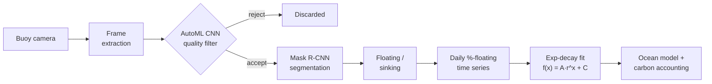

## Overview

This is a computer-vision pipeline that converts raw underwater imagery from Running Tide's open-ocean camera buoys into empirical sink rate curves. A sink rate curve is the per-batch sinking trajectory of carbon-bearing biomaterial as it descends through the water column. The CV pipeline is the in-situ measurement layer. Its output is one sink rate equation per batch, which feeds the carbon-accounting pipeline that produces our ocean carbon-removal credits. The output has to be accurate, conservative, and traceable back to specific source frames, so the design favors throwing away ambiguous data over admitting it.

This page is both a project write-up and a study guide. The top sections give a fast tour: what the buoys see, why the sink rate matters, and the shape of the pipeline. The numbered sections then go deep on each stage: the frame-quality filter, the Mask R-CNN segmentation, the floating-vs-sinking rule, the exponential-decay fit, evaluation, and the stack.

<div class="row">
  <div class="col-sm mt-3 mt-md-0 text-center">
    
  </div>
</div>
<div class="caption">
  Wood-chip detections (red boxes) from an underwater frame captured by a Running Tide camera buoy.
</div>

## The five things this pipeline does

1. **Ingest and filter.** Buoy camera video streams in over satellite. We extract frames and run each one through an AutoML CNN classifier that rejects fog, lens occlusion, bubbles, and biofouling. The filter is deliberately conservative.
2. **Segment.** Accepted frames go to a Mask R-CNN instance-segmentation model that produces a per-instance pixel mask for each biomaterial fragment, primarily wood chips.
3. **Classify floating vs sinking.** For each mask we take its midpoint and compare it to a manually defined threshold line per frame. Above the line is floating, below is sinking.
4. **Fit a curve.** Per-frame percent floating is averaged into one point per day, giving a time series of daily percent floating versus hours since deployment. We fit an exponential decay to that series.
5. **Hand off to the ocean model.** The fitted equation is the per-batch sink rate. The oceanography team reviews each fit, then it is folded into the data-assimilative ocean models that produce the final carbon accounting.

## Pipeline at a glance

```
buoy camera video (streamed via satellite)
  → frame extraction
  → frame-quality filter:  AutoML CNN classifier  →  reject (fog / occlusion / bubbles / biofouling)
                                                  →  accept
  → instance segmentation:  Mask R-CNN  →  per-instance mask per biomaterial fragment
  → floating-vs-sinking:    object is floating if its segmentation midpoint
                            is above a manually defined threshold line, else sinking
  → per-frame metric:       % wood chips floating
  → daily aggregate:        mean % floating across all accepted frames that day
  → time series:            daily % floating vs. hours since deployment
  → curve fit:              exponential decay  f(x) = A · r^x + C
  → sink rate equation → data-assimilative ocean model → carbon accounting
```

The same flow as a diagram, including the reject branch and the review gate:



## The imagery source: camera buoys

The input to the CV pipeline is real-time underwater video relayed from a fleet of custom ocean observation buoys that we designed and built in-house. Running Tide's camera product is named Camlite, which relays imagery via satellite in real time from the open ocean. Each buoy is a self-contained drifter. The topside is solar-powered and carries the antenna and electronics. The underwater enclosure holds the machine-vision camera and complementary biogeochemical sensors. A satellite uplink streams high-resolution biogeochemical data and in-situ imagery back to mission control as it happens.

The camera is one of three in-situ instruments. Two others travel on the same platforms and feed the same accounting. Accel records wave dynamics, trajectory, and sea-surface temperature back to our laboratories. GPS records trajectory data used to understand dispersion, sinking location, and growth conditions. The CV pipeline cross-checks its sink rate curves against the Accel and GPS streams.

<div class="row">
  <div class="col-sm mt-3 mt-md-0 text-center">
    
  </div>
</div>
<div class="caption">
  Camlite camera buoys on deck before deployment. Solar panels and antenna topside; mesh enclosure protecting the underwater camera and sensor stack.
</div>

<div class="row">
  <div class="col-sm mt-3 mt-md-0 text-center">
    
  </div>
  <div class="col-sm mt-3 mt-md-0 text-center">
    
  </div>
</div>
<div class="caption">
  Custom underwater sensor enclosures developed in-house to house the machine-vision camera and biogeochemical instruments.
</div>

We deployed buoy constellations from Running Tide's Iceland base into the North Atlantic in partnership with the shipping company Eimskip, whose vessels carried the platforms into remote Atlantic waters. The deployments went out in two separate constellations, the first in early December and the second in mid-January. The platforms held up through open-ocean conditions, including a large North Atlantic storm. Running Tide wound down operations in 2024, so the deployments described here span the program's active years.

<div class="row">
  <div class="col-sm mt-3 mt-md-0 text-center">
    
  </div>
</div>
<div class="caption">
  Open-ocean deployment in the North Atlantic near Iceland. The platforms drift freely after launch and stream imagery and sensor data back over satellite.
</div>

### What the camera actually sees

The buoy camera shoots continuous video of the water column below it. Frame quality varies with sea state, time of day, particulate load, and biofouling on the lens, so the pipeline has to handle everything from clean shots of falling wood chips to frames occluded by fog, bubbles, or zooplankton.

<div class="row">
  <div class="col-sm mt-3 mt-md-0 text-center">
    
  </div>
</div>
<div class="caption">
  Actual underwater buoy camera footage that the CV pipeline ingests.
</div>

The same buoy can return clean, analyzable wood-chip frames one hour and unusable frames the next, so the pipeline has to separate the two automatically before anything downstream looks at the imagery.

<div class="row">
  <div class="col-sm-4 mt-3 mt-md-0 text-center">
    
  </div>
  <div class="col-sm-4 mt-3 mt-md-0 text-center">
    
  </div>
  <div class="col-sm-4 mt-3 mt-md-0 text-center">
    
  </div>
</div>
<div class="caption">
  Good frames: clear water column, wood chips visible against the mesh background, threshold line readable.
</div>

<div class="row">
  <div class="col-sm-4 mt-3 mt-md-0 text-center">
    
  </div>
  <div class="col-sm-4 mt-3 mt-md-0 text-center">
    
  </div>
  <div class="col-sm-4 mt-3 mt-md-0 text-center">
    
  </div>
</div>
<div class="caption">
  Bad frames the filter rejects: biofouling and kelp occluding the lens, wave-entrained bubbles, and high turbidity from particulate load.
</div>

## Why sink rate matters

Running Tide's carbon-accounting framework rests on a per-batch empirical sinking curve. The question it answers is how fast this specific deployment of biomaterial drops through the water column on its way to long-term sequestration on the seafloor. The carbon-removal claim per batch depends directly on that curve. Modeled estimates alone are not sufficient, since the verification methodology requires in-situ measurement tied back to specific deployments. That measurement is then folded into the data-assimilative ocean models that produce the final accounting. The breadth of measurement across imagery, Accel, and GPS bounds the uncertainty and bakes in conservatism, which is what gives the carbon claim a high level of certainty.

The CV pipeline is the in-situ measurement layer. Its output is a sink rate equation per batch, passed to the ocean model that produces the carbon accounting.

## 1. Frame-quality filter

Open-ocean buoy footage is often noisy. Before any segmentation, each frame is run through an AutoML-trained CNN classifier, built on Google Cloud AutoML Vision, that labels it usable or not. The reject classes cover the dominant failure modes:

| Reject class | What it catches                                  |
| ------------ | ------------------------------------------------ |
| Fog          | Low-visibility water column, washed-out contrast |
| Occlusion    | Biofouling on the lens, marine-snow plumes       |
| Bubbles      | Wave entrainment near the surface                |

The filter is deliberately conservative: losing borderline frames is acceptable since the downstream curve fit averages over many accepted frames, but letting through frames with confounding artifacts biases the measurement. The internals of the AutoML model are abstracted by the service, so we tune it through the labeled examples and the accept threshold rather than the architecture.

## 2. Instance segmentation (Mask R-CNN)

Accepted frames are passed to a Mask R-CNN instance-segmentation model trained on a hand-labeled corpus of roughly 2,000 underwater frames containing biomaterial fragments, primarily wood chips in the carbon-removal deployments. Mask R-CNN extends Faster R-CNN with a parallel mask-prediction branch and RoIAlign, so it produces a pixel-accurate mask for each detected instance rather than just a box.

We chose Mask R-CNN over a simpler bounding-box detector for three reasons:

- The downstream metric is pixel area. Bounding boxes overestimate area for elongated or irregularly shaped fragments, while a per-instance mask measures the actual footprint.
- Multiple fragments often overlap in the frame. Instance masks separate them cleanly, whereas a single semantic-segmentation mask conflates touching fragments into one blob.
- Per-fragment shape comes out as a side product, which is useful for downstream phenotyping work.

<div class="row">
  <div class="col-sm-4 mt-3 mt-md-0 text-center">
    
  </div>
  <div class="col-sm-4 mt-3 mt-md-0 text-center">
    
  </div>
  <div class="col-sm-4 mt-3 mt-md-0 text-center">
    
  </div>
</div>
<div class="caption">
  Mask R-CNN outputs across a range of conditions: sparse chips drifting against the mesh, dense rafts of chips clumped at the surface, and a mixed scene with both surface aggregates and individual chips mid-descent.
</div>

## 3. Floating-vs-sinking classification

For each segmented object we compute the midpoint of its mask. Each frame carries a manually defined threshold line drawn across it. If a midpoint sits above that line the object is classified as floating, and if it sits below the line it is classified as sinking.

Per frame, this gives one scalar: the percent of wood chips floating. Per-frame values are noisy, so we average across all accepted frames from the same day to produce one data point per day. Averaging over a day reduces the variance from transient effects like a passing wave or a brief turbidity spike. The full deployment is then a time series of daily percent floating versus hours since deployment.

## 4. Exponential-decay fit

The daily time series is fit to an exponential decay by non-linear least squares:

```
f(x)  =  A · r^x  +  C
```

The parameters carry physical meaning for a sinking batch:

| Parameter | Meaning                                                                      |
| --------- | ---------------------------------------------------------------------------- |
| `A`       | Initial excess floating fraction at deployment, above the long-run asymptote |
| `r`       | Per-hour decay factor; how quickly the floating fraction falls each hour     |
| `C`       | Residual floating-fraction asymptote the curve settles toward                |
| `x`       | Hours since deployment                                                       |

This is the exponential-decay-to-asymptote form, equivalent to `A · e^(-kx) + C` with `r = e^(-k)`. Fitting it smooths the raw signal and reduces the impact of outlier frames that survived the filter. The resulting equation is the sink rate for that batch and is passed to the ocean model that produces the carbon accounting. The oceanography team reviews each fit before it is certified.

<div class="row">
  <div class="col-sm mt-3 mt-md-0 text-center">
    
  </div>
</div>
<div class="caption">
  Example sink rate curve for one deployment. Each dot is a daily-averaged percent-floating value derived from segmentations across all accepted frames that day; the solid line is the exponential-decay fit. The fitted equation in the legend is the per-batch sink rate handed off to the ocean model.
</div>

## 5. Evaluation

- **Segmentation:** intersection-over-union (IoU) and COCO-style mean average precision (mAP) on the held-out portion of the labeled frame corpus. These are the standard Mask R-CNN mask metrics.
- **Sink-rate curves:** reviewed per batch by the oceanography team for biological plausibility, then cross-checked against the buoy's Accel and GPS trajectory data and the data-assimilative ocean models that consume the same deployments.
- **Selection cost:** the frame-quality reject rate is itself a monitored metric. A sudden spike usually indicates a hardware problem such as biofouling or lens damage, often before it shows up anywhere else, so the filter doubles as an early-warning signal.

Results from production deployments are internal to Running Tide and are not publicly reportable, so this page describes the methodology and the metrics used to evaluate it rather than specific figures.

## Stack

| Layer                 | Technology                                                                        |
| --------------------- | --------------------------------------------------------------------------------- |
| Language and numerics | Python (NumPy, SciPy, scikit-learn)                                               |
| Frame filter          | Google Cloud AutoML Vision CNN classifier                                         |
| Segmentation          | Mask R-CNN, trained on a custom corpus of roughly 2,000 labeled frames            |
| Curve fit             | Non-linear least-squares fit of the exponential-decay model (SciPy)               |
| Orchestration         | Cloud Composer / Airflow DAGs for daily ingest and processing of new buoy footage |
| Containerization      | Docker workers for reproducible, scalable inference on incoming streams           |

## Related Sources

- 🛰️ [Running Tide deploys open-ocean satellites in the North Atlantic](https://runningtidexmason.webflow.io/blog-post/running-tide-deploys-open-ocean-satellites-in-north-atlantic): the buoy platform, the North Atlantic deployment program, and the Eimskip partnership.
- 📊 [Quantification methodology](https://runningtidexmason.webflow.io/quantification): the Camlite, Accel, and GPS instruments, and how the CV-derived sink rate feeds the broader carbon accounting and data-assimilative ocean models.
- 🎙️ [AGU Ocean Sciences Meeting 2024 abstract](https://agu.confex.com/agu/OSM24/meetingapp.cgi/Paper/1490631): conference abstract presented at OSM24 in New Orleans.
