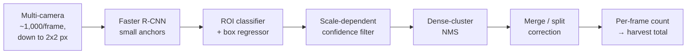

## Overview

The robotic shellfish counter is a computer-vision system that counts oysters as they move past a multi-camera rig on Running Tide's catamaran processing boat. It exists so the operations team gets an accurate total count per harvest run without a person tallying by hand. Each frame holds roughly 1,000 shellfish, and the smallest individuals are about 2×2 pixels at sensor resolution, so the counter has to be both dense-scene accurate and fast.

The detector is a Faster R-CNN with Region Proposal Network anchor scales tuned for the small-object regime. A custom post-processing pass runs after the detector and cleans up the smallest, noisiest detections before they reach the counter. The system runs at a per-frame budget of 0.125 s (about 8 FPS) to stay synchronized with the harvest stream, and it reaches over 90% accuracy against human counts at that throughput.

This was internal lab work at Running Tide, so there is no public repository and the training data, model internals, and per-step ablations are not publicly reportable. The verified, hard numbers are the four above: about 1,000 shellfish per frame, individuals down to 2×2 px, a 0.125 s per-frame budget, and over 90% accuracy against human counts. This page gives a fast tour up top, then goes deep on the imaging platform, the detector, and the post-processing pass that is the real differentiator.

<div class="row">
  <div class="col-sm mt-3 mt-md-0 text-center">
    
  </div>
</div>
<div class="caption">
  Oysters in the Dawson Metal stainless-steel bins. The bins flow past the camera rig during processing, and their uniform background simplifies the segmentation and counting stack.
</div>

## What it does, in four facts

| Property | Value |
| --- | --- |
| Shellfish per frame | ~1,000 |
| Smallest individuals | ~2×2 px at sensor resolution |
| Per-frame time budget | 0.125 s (~8 FPS) |
| Accuracy vs. human counts | >90% at that throughput |

## Pipeline

```
multi-camera frame  (high resolution, ~1,000 shellfish per frame, individuals as small as 2×2 px)
  → Faster R-CNN
        RPN proposals  →  per-region classifier + box regressor
        anchor scales tuned for the small-object regime
  → custom small-object post-processing pass
        scale-dependent confidence filter
        → dense-cluster NMS variant
        → merge / split correction
  → per-frame shellfish count
  → aggregate over the harvest stream
```

The same flow as a diagram, with the environmental telemetry shown as the side branch it is:



The counting path and the environmental telemetry path share the processing boat but are otherwise separate. The camera rig and detector produce counts. The Raspberry Pi layer streams sensor readings to the cloud.

## Stack at a glance

| Layer | What we used |
| --- | --- |
| Detector | Faster R-CNN, two-stage (RPN proposals, then per-region classifier and box regressor) |
| Anchors | RPN anchor scales and aspect ratios tuned for the small-object size distribution |
| Post-processing | Scale-dependent confidence filter, dense-cluster NMS variant, merge/split correction |
| Edge platform | ~half a dozen Raspberry Pis for environmental telemetry to the cloud |
| Fabrication | Aluminum catamaran processing boat and floating oyster reefs (in-house, TechPlace / former Brunswick Naval Air Station); Dawson Metal 18-gauge 316 stainless growth bins |
| Throughput target | 0.125 s/frame (~8 FPS) |
| End-to-end metric | Absolute counting error vs. human ground-truth on held-out frames |

---

## 1. The imaging platform

The CV system runs on Running Tide's custom aluminum catamaran oyster processing boat in the Casco Bay region of Maine, near Brunswick and Harpswell. Harvested stock moves past a multi-camera rig on the processing deck. Two floating aluminum oyster reefs slot into the centerline of the catamaran for harvest. Alongside the camera rig, a distributed edge-compute setup built on about half a dozen Raspberry Pis streams environmental telemetry, including temperature, acidity, and dissolved oxygen, to the cloud.

A note on dimensions: the vessel and reef sizes given here come from the internal project record and are not independently confirmed by the public sources I could reach. PCMag described the operation as a roughly 30-person Maine oyster farm running half a dozen Raspberry Pis. News Center Maine described a similar aluminum processing vessel in Middle Bay, within the Casco Bay region, feeding two-year-old oysters past a camera that photographs and measures each one before it drops into a bin, with the data shown on screens at the bow.

<div class="row">
  <div class="col-sm mt-3 mt-md-0 text-center">
    
  </div>
</div>
<div class="caption">
  Running Tide's aluminum oyster processing catamaran in the Casco Bay region of Maine. Two floating aluminum oyster reefs slot into the centerline for harvest, and the processing deck above houses the camera rig and edge compute.
</div>

<div class="row">
  <div class="col-sm mt-3 mt-md-0 text-center">
    
  </div>
</div>
<div class="caption">
  Wall of numbered control enclosures on the processing boat: the Raspberry Pi edge-compute stack that runs alongside the imaging system, handling environmental sensor ingestion and cloud relay.
</div>

### 1.1 What the cameras see

Each oyster goes from the reef where it grew, through stainless-steel bins, past the camera rig, and on through the rest of the processing pipeline. The bins were custom-fabricated by Dawson Metal in 18-gauge 316 stainless steel with a perforated bottom and single-piece construction. Dawson's single-piece redesign consolidated the original multi-piece part and eliminated about 20% of the parts, using PEM fasteners instead of screws and minimizing welds. The bins read as a uniform clean surface to the camera, which simplifies separating oysters from background. The background-for-CV benefit is our own observation, since Dawson's case study covers fabrication and corrosion resistance and does not mention imaging.

<div class="row">
  <div class="col-sm mt-3 mt-md-0">
    
  </div>
</div>
<div class="caption">
  Multi-camera view of the harvesting platform, with oysters identified per frame. This is the input the detector sees: a dense field of small objects against a uniform bin background.
</div>

### 1.2 Upstream context: the reefs

The aluminum oyster reefs were built in-house at TechPlace, the former Brunswick Naval Air Station. Each reef carries a propeller that circulates water across the stock, so the oysters keep feeding during slack tide. Steady feeding keeps the population density per harvest more predictable, which keeps the detector's input distribution stable from run to run.

<div class="row">
  <div class="col-sm mt-3 mt-md-0 text-center">
    
  </div>
</div>
<div class="caption">
  An aluminum oyster reef under construction at TechPlace. Reefs of this kind float at the catamaran's centerline and feed stock to the processing rig.
</div>

---

## 2. Detection: Faster R-CNN with small-object anchors

We chose a two-stage detector for this problem. Single-stage detectors in the YOLO and SSD families are faster, but their default anchor grids do not cleanly cover the 2×2-pixel regime. The dense small-object scene here is where the region-proposal stage of Faster R-CNN pays off.

- The Region Proposal Network can be configured with anchor scales and aspect ratios that match the actual size distribution of shellfish in the frame, which is heavily skewed to the small end.
- The two-stage cascade gives small candidate boxes a second pass of classification and box regression, which is more forgiving on edge-case detections than a single feed-forward pass.

The detector outputs a class score and a regressed box for each region proposal. Those boxes are what the post-processing pass operates on.

For method-name grounding: the original Faster R-CNN is Ren et al. (NeurIPS 2015), and small-object adaptations in the literature commonly shrink RPN anchor areas, add multi-scale features, raise input resolution, and swap plain IoU-NMS for soft-NMS to preserve recall in dense scenes. Those specific anchor numbers and the soft-NMS variant are general-literature illustrations of the technique class, not the exact configuration deployed here.

---

## 3. Small-object post-processing

The smallest detections, near 2×2 px, are noise-dominated. At that scale a few pixels of motion blur, shadow, or sensor noise can produce a spurious box or merge two adjacent oysters into one. A custom post-processing pass runs after the detector to clean these up before counting. This pass is the project's differentiator. It is the part most tuned to the specific imaging conditions on the boat.

The pass has three stages, in order:

| # | Stage | Why it exists |
| --- | --- | --- |
| 1 | Scale-dependent confidence filter | A fixed confidence threshold is wrong across scales. Small boxes are noise-dominated, so their threshold has to depend on box scale rather than a single global cutoff. |
| 2 | Dense-cluster NMS variant | Plain IoU-NMS over-suppresses legitimate adjacent detections when oysters are packed tightly. A variant tuned for dense clusters preserves neighbors that standard NMS would wrongly merge. |
| 3 | Merge / split correction | Motion blur or shadow can merge two oysters into one box or split one oyster into two. This stage corrects ambiguous adjacent boxes before the final count. |

The literature analogue for stage 2 is soft-NMS, which down-weights rather than discards overlapping boxes to keep recall in crowded scenes. I am not reporting per-stage ablation deltas, since those numbers are not publicly available.

---

## 4. Throughput and evaluation

The platform requires per-frame inference at 0.125 s, about 8 FPS, to keep pace with the harvest stream. The deployed Faster R-CNN, with its tuned anchor configuration and the post-processing pass, reaches over 90% accuracy against human counts at that throughput.

Evaluation runs at two levels:

- Detection level: classification cross-entropy plus bounding-box L1/L2 regression error, the standard Faster R-CNN training and validation signals.
- End to end: absolute counting error against human ground-truth counts on held-out frames. This is the metric the operations team cares about, since the deliverable is the total count per harvest run.

I am not reporting precision, recall, mAP, dataset sizes, or training details, since none of those are publicly available for this internal system.

## Related Sources

- 📰 [How a Half-Dozen Raspberry Pis Help Keep This Maine Oyster Farm Afloat](https://www.pcmag.com/news/how-a-half-dozen-raspberry-pis-help-keep-this-maine-oyster-farm-afloat): PCMag (Jon Kalish), ~2020. Context on Running Tide's processing boat and Raspberry Pi sensor stack; the full article body was not machine-retrievable, so only the headline-level facts (six Pis, ~30-person staff) are cited.
- 📺 [Maine startup aims to rebalance the ocean](https://www.newscentermaine.com/article/news/special-reports/maines-changing-climate/maine-startup-aims-to-rebalance-the-ocean-running-tide-technologies-oyster-climate-change-ocean/97-43020c4d-df9d-490c-a9bc-7fa7b4b9c965): News Center Maine, July 18, 2022. Corroborates the camera-based counting of oysters fed past the rig on the aluminum processing vessel.
- 🏭 [Dawson Metal: Shellfish Bins case study](https://www.dawsonmetal.com/case-studies/shellfish-bins): fabrication details for the 18-gauge 316 stainless-steel oyster bins that flow through the imaging platform.
- 📄 [Faster R-CNN (Ren et al., NeurIPS 2015)](https://proceedings.neurips.cc/paper/2015/file/14bfa6bb14875e45bba028a21ed38046-Paper.pdf): the two-stage detector architecture this system is built on.
- 📄 [Small Object Detection via Modified Faster R-CNN](https://www.mdpi.com/2076-3417/8/5/813): background on small-object adaptations (anchor resizing, NMS variants) cited here as method grounding only.
</content>
</invoke>
