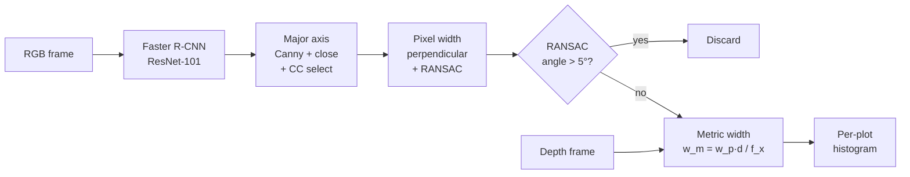

## Overview

This is a computer-vision pipeline for measuring the stem width of biofuel plants (corn and sorghum) directly in the field. The input is RGB + depth imagery from a stereo camera mounted on a mobile robot that traverses crop rows. The output is a per-plot histogram of stem widths, where each plot is one genetic strain. Stem width is a phenotype that links a plant's genotype to its biomass yield, so a rapid in-situ measurement lets breeders screen strains far faster than hand-measuring plants one at a time.

The pipeline isolates individual stems with a CNN detector, models each stem's boundary with classical edge processing and RANSAC line fits, discards low-confidence cases, and converts pixel width to metric width using paired depth data. Because the downstream consumer is a per-plot distribution rather than a per-plant reading, the design favors precision over recall: it discards aggressively and keeps only estimates it trusts. We built this at UC Berkeley in Avideh Zakhor's group, funded by ARPA-E (U.S. Department of Energy, Award DE-AR0000598), and published it at Electronic Imaging 2019.

This page is both a project write-up and a study guide. The top sections give a fast tour of the hardware and the data flow. The later numbered sections go deep on each of the four pipeline stages, the two evaluation datasets, the full per-plot and per-plant results, and the failure modes.

## Publication

📄 Sahiner A, **Heng F**, Balamurugan A, Zakhor A. **"In Situ Width Estimation of Biofuel Plant Stems."** _Electronic Imaging_ 2019, Vol. 31, Issue 13, pp. 138-1–138-7. DOI 10.2352/ISSN.2470-1173.2019.13.COIMG-138. [Paper PDF](https://www-video.eecs.berkeley.edu/papers/asahiner/sahiner-stem-width-spie-2018.pdf) · [Conference page](https://library.imaging.org/ei/articles/31/13/art00009)

## Why stem width matters

Plant phenotyping is the bottleneck in biofuel-crop breeding. A breeder grows many genetic strains in adjacent plots, then needs to know which strains produce the most usable biomass. Stem width is one of the phenotypes that correlates with yield. Measuring it by hand with calipers across hundreds of plants is slow and error-prone, and the labor cost scales with the number of strains under test. The goal here is to replace that manual loop with a robot pass that produces a width distribution per plot, so a breeder can compare strains at the scale a breeding program actually runs at.

## Sensor Setup

The capture rig is an **Intel RealSense R200** stereo camera mounted on a wheeled robot that drives down the gap between two crop rows, looking sideways into the plants. The R200 collects RGB, infrared, and stereoscopic depth at relatively low cost, which is what makes a field-scale, many-pass survey affordable. RGB + depth frames are captured at a fixed rate as the robot moves. Each plot holds roughly 50 plants of one genetic strain, and the downstream goal is a per-plot **histogram of stem widths**, so the pipeline favors high precision per estimate over perfect recall.

<div class="row">
  <div class="col-sm mt-3 mt-md-0 text-center">
    
  </div>
</div>
<div class="caption">
  <b>Figure 1.</b> Sensor setup. The robot moves down the inter-row gap with the stereo camera looking sideways into the crop row, capturing one strain per plot.
</div>

## Pipeline

The paper frames the method as four main stages: stem detection, major-axis estimation, pixel-width estimation, and metric-width estimation, with a confidence filter sitting between the pixel and metric stages.

```
RGB frame   ─┐
             ├─→  Stem Detection  →  Major Axis Estimation  →  Pixel Width Estimation  →  Confidence Filter  →  Metric Width Estimation  →  width estimate
Depth frame ─┘    (Faster R-CNN)     (Wiener + HistEq + Canny    (fine morph closing       (RANSAC angle           (depth + focal length)
                                      + coarse morph close 30×15   + perpendicular probes    > 5° → discard)
                                      + connected-component        + RANSAC line fit
                                      selection)                    per side)
```

The same data flow as a diagram. Note that depth feeds only the final metric-conversion node; every stage before it runs on RGB alone.



<div class="row">
  <div class="col-sm mt-3 mt-md-0 text-center">
    
  </div>
</div>
<div class="caption">
  <b>Figure 2.</b> Block diagram of the proposed approach. RGB feeds the detection and width pipeline; depth feeds only the final metric conversion step.
</div>

This pipeline extends an earlier Berkeley method (Baharav, Bariya & Zakhor 2017) that worked from 2.5D infrared imagery using Frangi filters and a Hough transform. Here we move to a deep detector for stem isolation, swap the Hough fit for RANSAC, and add a depth-based metric conversion.

## Stack at a glance

| Layer               | Technology                                                                                                                                                                        |
| ------------------- | --------------------------------------------------------------------------------------------------------------------------------------------------------------------------------- |
| Language / numerics | Python (NumPy, SciPy, scikit-image, scikit-learn)                                                                                                                                 |
| Detection           | Faster R-CNN with ResNet-101 backbone, fine-tuned on 2,000 hand-labeled corn + sorghum images                                                                                     |
| Image processing    | Wiener filter, histogram equalization, Canny edges, morphological closing (`30×15` coarse, `12×4` fine), connected-component analysis, RANSAC line fitting (independent per side) |
| Geometry            | Connected-component orientation for the major axis, perpendicular-probe sampling for boundary points, pinhole depth-to-metric conversion                                          |
| Hardware            | Intel RealSense R200 stereo camera (RGB + IR + stereo depth) on a wheeled robot                                                                                                   |

---

## 1. Stem Detection (Faster R-CNN)

Each RGB frame may contain several stems plus heavy leaf clutter. **Faster R-CNN with a ResNet-101 backbone** (Ren et al. 2015) proposes bounding boxes around individual stems with confidence scores. We fine-tuned a pretrained checkpoint (from the Eniac-Xie faster-rcnn-resnet repository) on **2,000 hand-labeled corn + sorghum images**. The two-stage design (region proposal network then classifier) gives clean per-stem crops despite the dense, overlapping leaves in plot imagery.

Each detection produces a cropped RGB patch and the matching cropped depth patch, which both flow into the rest of the pipeline. Frame-to-frame stem tracking is deliberately skipped. The same stem may appear in adjacent frames, so duplicate detections exist, but across 50 plants per row those duplicates do not bias the per-plot mean appreciably.

<div class="row">
  <div class="col-sm mt-3 mt-md-0 text-center">
    
  </div>
</div>
<div class="caption">
  <b>Figure 3.</b> Faster R-CNN per-stem detections on an in-situ corn frame.
</div>

## 2. Major Axis Estimation

Within each stem crop, the algorithm needs a stable estimate of the stem's centerline and orientation before it can measure width. The chain:

1. **Adaptive Wiener filter** to denoise (suppresses speckle without blurring edges).
2. **Histogram equalization** to boost local contrast.
3. **Canny edge detector** for an edge profile that favors connected contours over isolated points.

<div class="row">
  <div class="col-sm mt-3 mt-md-0 text-center">
    
  </div>
</div>
<div class="caption">
  <b>Figure 4.</b> (a) Detection crop. (b) After Wiener denoise + contrast equalization. (c) Canny edge profile.
</div>

4. **Coarse morphological closing** on the complement of the binary edge image with a large `30 × 15` rectangular structuring element to extract big structures and suppress small leaf fragments.
5. **Connected-component selection** of the dominant stem region. Each candidate is scored by a weighted average of three features: large area, proximity to the image center, and near-vertical orientation, under the prior that the stem is the largest near-vertical structure near the center of the crop. The highest-scoring component is taken as the stem.
6. The selected component's location and orientation give the stem's major-axis line.

<div class="row">
  <div class="col-sm mt-3 mt-md-0 text-center">
    
  </div>
</div>
<div class="caption">
  <b>Figure 5.</b> (a) Canny edge profile. (b) Coarse morphological closing isolates large structures. (c) Selected connected component + overlaid major axis.
</div>

## 3. Pixel Width Estimation

Coarse morphology was tuned to find the stem. For the actual boundary, a **finer morphological closing** with a smaller `12 × 4` structuring element is run to keep edge detail. Along the major axis, the algorithm samples points at equidistant spacing and **shoots perpendicular probe lines** out from the axis. The first edge crossing on each side at each probe gives a candidate boundary point.

<div class="row">
  <div class="col-sm mt-3 mt-md-0 text-center">
    
  </div>
</div>
<div class="caption">
  <b>Figure 6.</b> (a) Canny edge profile along the stem region. (b) After fine-resolution morphological closing. (c) Perpendicular probe lines along the major axis.
</div>

Each side's candidate points typically include outliers from leaves and occluders. **RANSAC** is run independently on the left and right point sets, fitting a line per side and rejecting outliers, since corn and sorghum stems have almost no curvature over the visible segment. We chose RANSAC over a Hough transform for better accuracy and faster computation on noisy line-fitting of this kind (cited in the paper).

```
pixel_width = mean( perpendicular distance between the two RANSAC lines )
```

<div class="row">
  <div class="col-sm mt-3 mt-md-0 text-center">
    
  </div>
</div>
<div class="caption">
  <b>Figure 7.</b> (a) Candidate boundary points. (b) RANSAC lines overlaid on the fine morphological profile. (c) Final boundary lines on the original RGB crop.
</div>

## 4. Confidence Filter

Real stems have near-parallel sides. The angle between the two RANSAC-fit lines is a cheap, principled confidence signal: if it exceeds **5°**, the estimate is discarded. This rejects most cases corrupted by motion blur from the moving robot, leaf occlusion, or detection-box misalignment. Because the downstream consumer is a per-plot histogram, dropping low-confidence frames does not appreciably bias the per-plot mean, which is why the filter can afford to be this aggressive.

<div class="row">
  <div class="col-sm mt-3 mt-md-0 text-center">
    
  </div>
</div>
<div class="caption">
  <b>Figure 8.</b> (a) Blurry stem image. (b) Noisy Canny profile. (c) RANSAC lines diverge well beyond 5°, so the estimate is discarded.
</div>

## 5. Metric Width Estimation

Converting pixel width to metric width requires the camera's focal length, the per-pixel depth to the stem, and an aligned RGB-depth pair. The RealSense RGB and depth streams are offset on the sensor and the offset varies with robot speed, so a **manual constant shift** is applied per dataset to register depth onto RGB.

<div class="row">
  <div class="col-sm mt-3 mt-md-0 text-center">
    
  </div>
</div>
<div class="caption">
  <b>Figure 9.</b> (a) RGB image of two stems. (b) Corresponding depth heat map. The vertical stripes in the depth map are the stems; the depth stream is shifted left of the RGB stream, motivating the manual alignment step.
</div>

Once aligned, depth values for all pixels inside the segmented stem boundary are averaged to produce a single distance `d`. The metric width is then:

```
w_m = w_p · d / f_x
```

where `w_m` is the metric width, `w_p` is the pixel width, `d` is the depth to the stem, and `f_x` is the camera's focal length in pixels.

## 6. Datasets + Ground Truth

Two evaluation datasets, one in-situ and one phantom.

- **In-situ corn** (pixel-only ground truth): the robot drove through 6 rows of distinct corn plots, 50 plants each, in outdoor conditions. Faster R-CNN produced 531 bounding-box images. Pixel ground truth was hand-labeled at three locations along each detected stem and averaged. Metric ground truth was not collected, since manual caliper measurement on hundreds of in-field plants was infeasible.

<div class="row">
  <div class="col-sm mt-3 mt-md-0 text-center">
    
  </div>
</div>
<div class="caption">
  <b>Figure 10.</b> Pixel-domain ground-truth labeling on an in-situ corn stem. Three red lines mark the locations where pixel width was measured; the three values are averaged.
</div>

- **Phantom sorghum** (pixel + metric ground truth): the stereo camera moved across 5 closely positioned phantom sorghum plants over 117 frames. Faster R-CNN detected 390 stem portions. Metric ground truth was acquired with **caliper measurements** at three points along each stem, then averaged.

<div class="row">
  <div class="col-sm mt-3 mt-md-0 text-center">
    
  </div>
</div>
<div class="caption">
  <b>Figure 11.</b> Phantom sorghum plants captured by the stereo camera.
</div>

## 7. Results

The headline numbers: 13.5% average absolute pixel error on corn across 153 estimates, and 13.2% average absolute metric error on phantom sorghum across 149 estimates.

| Dataset         | Domain | Estimates generated | Discarded | Avg % Absolute Error |
| --------------- | ------ | ------------------- | --------- | -------------------- |
| Corn (in situ)  | Pixel  | 153 / 531           | 71% (378) | **13.5%**            |
| Phantom sorghum | Pixel  | 149 / 390           | 62% (241) | **14.7%**            |
| Phantom sorghum | Metric | 149 / 390           | 62% (241) | **13.2%**            |

The "discarded" count is the number of detections the confidence filter rejected (for example, 390 detections minus 149 generated estimates leaves 241 discarded on phantom sorghum). The discard rate is high by design.

### 7.1 Corn pixel results, per plot

Signed % error, absolute % error, and discard rate per plot.

| Plot    | Avg % Error | Avg % Abs Error | Discarded         |
| ------- | ----------- | --------------- | ----------------- |
| P1      | 8.4         | 10.6            | 55% (40/73)       |
| P2      | 8.9         | 15.8            | 64% (87/135)      |
| P3      | 3.4         | 10.9            | 73% (77/106)      |
| P4      | 3.3         | 17.8            | 70% (52/74)       |
| P5      | -2.7        | 10.2            | 85% (64/75)       |
| P6      | -3.3        | 13.3            | 85% (55/65)       |
| **All** | **5.3**     | **13.5**        | **71% (378/531)** |

### 7.2 Phantom sorghum results, per plant

Pixel and metric error per plant, with the per-stem ground-truth variation (the spread of the three caliper or hand-labeled points along a single stem).

| Plant   | Pixel % Err | Pixel % Abs Err | GT var  | Discarded         | Metric % Err | Metric % Abs Err |
| ------- | ----------- | --------------- | ------- | ----------------- | ------------ | ---------------- |
| P1      | -0.1        | 10.1            | 4.3     | 41% (23/56)       | 1.4          | 9.4              |
| P2      | 9.8         | 9.8             | 9.8     | 97% (32/33)       | 0.9          | 0.9              |
| P3      | -14.3       | 15.1            | 7.0     | 63% (74/118)      | -12.8        | 13.7             |
| P4      | -6.5        | 13.1            | 4.6     | 48% (39/81)       | -7.8         | 13.6             |
| P5      | 0.2         | 22.0            | 6.1     | 72% (73/102)      | 3.5          | 16.8             |
| **All** | **-6.0**    | **14.7**        | **6.4** | **62% (241/390)** | **-5.0**     | **13.2**         |

Even on Plant 2, where only **1 of 33** detections survived the filter, that single estimate was accurate, which supports the design choice that per-plot histograms tolerate aggressive filtering.

Most of the residual error sits in pixel-width estimation. The per-stem ground-truth variation, the spread among the three labeled points along one stem, is roughly 1–10% depending on the stem and domain (6.4% on average for the pixel set, 4.3% for the metric set). A meaningful fraction of the pipeline error therefore sits at the floor of physical measurement noise.

## 8. Failure Modes

The dominant failure mode is **major-axis misestimation under heavy leaf occlusion**. When a leaf covers a large fraction of the stem in the detection crop, coarse morphological closing keeps the leaf as the dominant connected component and the axis is fit to the wrong structure. This is exactly what drives Plant 2's 97% discard rate: nearly every frame was rejected, and only the one clean estimate survived.

<div class="row">
  <div class="col-sm mt-3 mt-md-0 text-center">
    
  </div>
</div>
<div class="caption">
  <b>Figure 12.</b> Plant 2 with an occluding leaf on the right side, and its coarse morphological representation. The leaf is selected as the dominant structure, corrupting axis estimation.
</div>

The paper flags two natural extensions: replace the classical edge + morphology boundary modeling with a **learned segmentation network**, and replace the manual RGB-depth shift with **automated alignment**.

## Related Sources

- [Paper (SPIE Electronic Imaging)](https://library.imaging.org/ei/articles/31/13/art00009): the full publication, with all tables and per-plot results.
- Baharav, Bariya & Zakhor 2017: the prior Berkeley 2.5D-infrared method (Frangi filters + Hough transform) that this work extends.
- StalkNet (Baweja et al. 2018): a contemporaneous deep-learning approach to stalk width and counting.
- Jin & Zakhor 2017: point-cloud-based sorghum stem width estimation from the same group.
- Faster R-CNN (Ren et al. 2015): the object detector fine-tuned here for per-stem detection.
- Intel RealSense R200 (Keselman et al. 2017): the low-cost RGB + IR + stereo-depth camera used as the capture rig.
- ARPA-E, U.S. Department of Energy, Award DE-AR0000598: the funding that supported this research.
