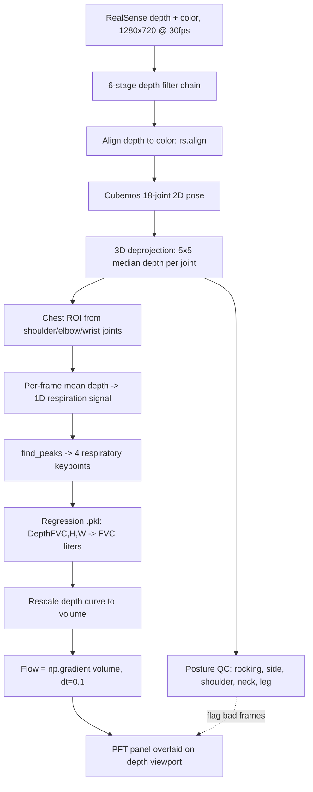

> 🥈 2nd place, UC Launch · Funded by UCSF Catalyst · NSF I-Corps · 📜 [US Patent US20240090795A1](https://patents.google.com/patent/US20240090795A1/en)

## Overview

Breathily was a startup we built between 2020 and 2022 to make lung function testing accessible to patients who cannot use a standard spirometer. Standard spirometry needs a tight mouth seal and a hard forced exhale, which is difficult or impossible for patients with facial muscle weakness or limited mobility, including ALS and related neuromuscular conditions. Our system estimates pulmonary function from chest wall motion captured by an Intel RealSense depth camera, with no mouthpiece, and reports the full spirometric panel: FVC, FEV1, FEV1/FVC, PEF, FEF25/50/75, and FEF25–75.

The work is the subject of US patent application US20240090795A1, "Methods for Pulmonary Function Testing With Machine Learning Analysis and Systems for Same," with Franklin Heng and Xavier Minh Mathieu Orain as named inventors. We evaluated the system in an IRB-approved clinical pilot at the UCSF Adult Pulmonary Function Lab, with simultaneous depth capture and reference spirometry on the same patient.

This page is both a project write-up and a study guide. The top sections give a fast tour of what the system does. The numbered sections go deep on every stage of the shipped prototype: hardware capture, skeleton tracking, posture quality monitoring, chest ROI extraction, respiratory keypoint detection, depth-to-volume calibration, and the PFT panel. One thing this page is careful about: it separates what the archived prototype code actually does from the broader scope the patent claims. See Section 9 for that distinction.

<div class="row">
  <div class="col-sm mt-3 mt-md-0 text-center">
    
  </div>
</div>
<div class="caption">
  Processing pipeline: depth and color capture, skeleton tracking, chest region segmentation, segment-wise depth signals, and Breathily versus spirometer curves.
</div>

## Demo

<div class="row">
  <div class="col-sm mt-3 mt-md-0">
    <div class="embed-responsive embed-responsive-16by9 rounded z-depth-1" style="overflow: hidden;">
      <iframe
        class="embed-responsive-item"
        src="https://www.youtube.com/embed/MaBf3D1GvQA"
        title="Breathily overview demo"
        frameborder="0"
        allow="accelerometer; autoplay; clipboard-write; encrypted-media; gyroscope; picture-in-picture; web-share"
        allowfullscreen></iframe>
    </div>
  </div>
</div>
<div class="caption">
  Overview demo of the Breathily contactless spirometry system.
</div>

### Spirometer Comparison

Side-by-side comparison of Breathily and standard spirometry.

<div class="row">
  <div class="col-sm mt-3 mt-md-0 text-center">
    <video controls playsinline preload="auto" class="rounded z-depth-1" style="width: 100%; max-width: 100%; height: auto;">
      <source src="{{ '/assets/video/projects/breathily_spirometer_comparison.mp4' | relative_url }}" type="video/mp4">
      Your browser does not support embedded video. <a href="{{ '/assets/video/projects/breathily_spirometer_comparison.mp4' | relative_url }}">Download the clip</a>.
    </video>
  </div>
</div>

### Clinical Lab Testing

Testing setup at the UCSF Adult Pulmonary Function Lab during IRB-approved studies.

<div class="row">
  <div class="col-sm mt-3 mt-md-0 text-center">
    <video controls playsinline preload="auto" class="rounded z-depth-1" style="width: 100%; max-width: 100%; height: auto;">
      <source src="{{ '/assets/video/projects/breathily_clinical_lab_testing.mp4' | relative_url }}" type="video/mp4">
      Your browser does not support embedded video. <a href="{{ '/assets/video/projects/breathily_clinical_lab_testing.mp4' | relative_url }}">Download the clip</a>.
    </video>
  </div>
</div>

## What Breathily does

1. **Captures depth and color.** An Intel RealSense camera streams aligned depth and color at 1280×720, 30 fps, with a 6-stage depth post-processing chain on every frame.
2. **Tracks the patient's body.** The Cubemos Skeleton Tracking SDK produces an 18-joint 2D pose on the color frame, and RealSense deprojects each joint to a metric 3D point using a 5×5 pixel median depth.
3. **Watches posture in real time.** Five quality checks (rocking, side movement, shoulder lift, neck movement, leg angle) compare the live skeleton to a per-session baseline, so the operator can correct the patient before the data is corrupted.
4. **Builds the chest signal.** A chest ROI is cut from the shoulder, elbow, and wrist joints, and the mean depth inside that box per frame is the 1D respiratory waveform.
5. **Segments the breath.** `scipy.signal.find_peaks` extracts four respiratory keypoints from the waveform, bracketing the forced-exhale segment.
6. **Converts depth to volume.** A regression model rescales the depth waveform to a liter-valued volume curve, and the PFT panel is computed from the volume and its time derivative.

## Recognition

- 2nd Place, UC Launch Accelerator Program
- Funding and support from the UCSF Catalyst Program
- NSF I-Corps participant
- US Patent Application [US20240090795A1](https://patents.google.com/patent/US20240090795A1/en) (priority 2021-02-03, filed 2022-02-02, published 2024-03-21; assigned to The Regents of the University of California)

## End-to-End Pipeline

The archived prototype is a Python pipeline driven from a Jupyter notebook (`pipeline_master_v2.ipynb`) over five helper modules. The data flow:

```
RealSense depth + color stream (1280×720 @ 30 fps, z16 + bgr8)
  → depth post-processing chain (decimation → disparity →
       spatial → temporal → disparity⁻¹ → hole-filling)
  → depth-color frame alignment (rs.align)
  → Cubemos 2D skeleton tracking on color frame (18 joints)
  → 3D keypoint deprojection (median depth in 5×5 px kernel
       per joint, gated by confidence ≥ 0.2 and depth ≥ 0.3 m,
       via rs2_deproject_pixel_to_point)
  → real-time posture quality checks (rocking, side, shoulder,
       neck, leg) against a per-session baseline
  → chest ROI from shoulder + elbow + wrist joints
       (top = shoulders, bottom = shoulder + 0.7·(wrist − shoulder))
  → per-frame chest displacement = mean depth inside ROI
  → 1D respiration time series
  → scipy.signal.find_peaks → 4 respiratory keypoints
       (tidal start, tidal end, exhale start, exhale end)
  → regression model (DepthFVC, Height, Weight → FVC liters)
       rescales the depth curve to true volume
  → flow curve = np.gradient(volume, dt = 0.1)
  → PFT panel: FVC, FEV1, FEV1/FVC, PEF, FEF25/50/75, FEF25–75
       overlaid live on the depth viewport
```

The same flow as a diagram, with the two parallel branches (posture QC and the chest signal) made explicit:



The five helper modules are `realsense_manager.py` (capture), `skeleton_tracking.py` (pose + posture QC), `patient_measurement.py` (chest ROI + body measurements), `lung_measurement.py` (keypoints, calibration, PFT), and `user_control.py` (operator keys). The sections below walk each stage with the real parameters from the code.

## Stack at a glance

| Layer                        | Technology                                                                                                                        |
| ---------------------------- | --------------------------------------------------------------------------------------------------------------------------------- |
| Language / runtime           | Python 3                                                                                                                          |
| Depth sensing                | Intel RealSense (D-series) via `pyrealsense2`; 6-stage filter chain; depth-color alignment; intrinsics-driven metric deprojection |
| Pose estimation              | Cubemos Skeleton Tracking SDK (2D, 18 joints, CPU); 3D via RealSense deprojection with 5×5 median depth                           |
| Numerics + signal processing | NumPy, SciPy (`find_peaks`, `np.gradient`, `resample`, FFT cross-correlation), pandas                                             |
| Regression                   | `latest_model.pkl` loaded via `joblib`; not included in the repo (lived on a local `D:/` path)                                    |
| Image processing             | OpenCV (frame ops + overlays), point-cloud / mesh helpers                                                                         |
| Live UI                      | OpenCV window with a matplotlib breathing graph rasterized into the same viewport                                                 |
| Hardware                     | Intel RealSense depth camera, Intel NUC mini-PC, Arduino-driven touchscreen, custom 3D-printed enclosure                          |

---

## 1. Hardware Capture (`realsense_manager.py`)

The `DeviceManager` class wraps the `pyrealsense2` SDK. Per session it does the following.

- **Streams enabled:** depth (`rs.format.z16`, 1280×720, 30 fps) and color (`rs.format.bgr8`, 1280×720, 30 fps). These are the constructor defaults.
- **Six-stage depth post-processing chain** applied in this exact order: decimation filter, disparity transform (forward), spatial filter, temporal filter, disparity transform (backward), hole-filling filter. The disparity round-trip puts the spatial and temporal filters in disparity space, where they behave better, then returns to depth. The hole-filling step fills missing-depth pixels from valid neighbors.
- **Frame alignment** via `rs.align(rs.stream.color)`, so each depth pixel has a matching color pixel.
- **Intrinsics and a pixel-to-meters scale** pulled live from the active depth sensor via `get_depth_scale()`.
- **IR emitter toggle** through `set_option(rs.option.emitter_enabled, ...)`, so the operator can compare laser-projected and passive stereo depth per patient.
- **Playback support** for recorded sessions through `rs.config.enable_device_from_file(..., repeat_playback=True)`. The same code path runs live capture or a recording, which is what made the offline analysis notebooks possible against the same module.

One detail worth being honest about: the decimation step in the chain runs at the SDK default magnitude. The code does construct a separate decimation object with `filter_magnitude = 2`, but that object is not the one appended to the active filter list, so the chain decimates at the default.

## 2. Skeleton Tracking (`skeleton_tracking.py`)

Pose estimation runs on the color frame through the Cubemos Skeleton Tracking SDK, which produces an 18-joint 2D skeleton on CPU. The cloud API key is passed as an empty string, so tracking runs offline. The code indexes joints by integer: 0 head/nose, 1 neck-midpoint, 2 right shoulder, 3 right elbow, 5 left shoulder, 6 left elbow, 8 right wrist, 11 left wrist, 9 and 12 knees, 10 and 13 ankles, and 14–17 eyes and ears.

The 3D coordinate for each 2D joint comes from RealSense itself:

- For each 2D joint `(x, y)`, sample the depth values inside a 5×5 pixel kernel around it (`distance_kernel_size = 5`).
- Take the median of the kernel via `np.percentile(..., 50)`, which suppresses single-pixel depth noise.
- If the median is at least 0.3 m and the joint confidence exceeds the threshold (default 0.2), call `rs.rs2_deproject_pixel_to_point(intrinsics, [x, y], median)` to get the metric `(X, Y, Z)` keypoint.

The 5×5 median is the reason chest displacement stays clean despite the RealSense depth noise floor: every per-joint depth value is already a small local consensus before any of it reaches the chest signal.

## 3. Real-Time Posture Quality Monitoring (`skeleton_tracking.py`)

A contactless reading is only valid if the patient sits still. Five posture checks run on every frame, each comparing the live skeleton to a per-session baseline that the operator captures by pressing the `b` key. The thresholds below are taken straight from the code.

| Check         | What it measures                                               | Flagged when                            |
| ------------- | -------------------------------------------------------------- | --------------------------------------- |
| Rocking       | Mean z (depth) of left shoulder, right shoulder, neck-midpoint | `abs(prev_z − avg) > 0.05`              |
| Side movement | Mean x of the two shoulder joints                              | `> 5`                                   |
| Shoulder lift | Mean y of the two shoulder joints                              | `> 5`                                   |
| Neck movement | Mean x of the 5 head joints (nose, both ears, both eyes)       | `> 10`                                  |
| Leg position  | Per-leg knee-to-ankle angle via right-triangle trig            | angle `≤ 80°` or `≥ 100°` on either leg |

The leg angle comes from `compute_angle`, an arcsine of the opposite over the hypotenuse in degrees, so a roughly vertical shin (near 90°) reads as a good seated posture. Each check renders a "Good" or "Bad" status overlay on the depth viewport in real time, so the operator can correct the patient mid-session rather than discover motion-corrupted data afterward.

## 4. Chest ROI + Displacement Signal (`patient_measurement.py`)

The chest displacement signal is the raw input to everything downstream. The ROI is built from skeleton keypoints in `compute_chest_displacements`:

```
roi_top    = max(y_left_shoulder, y_right_shoulder) − 10 px      # joints 5, 2
roi_bottom = roi_top + 0.7 · (min(y_left_wrist, y_right_wrist) − roi_top)
# x bounds: baseline frame uses wrist x; the per-frame
# measurement uses elbow x (joints 3 and 6)
```

The vertical extent is anchored at the shoulders on top and clipped at 70% of the way down to the wrists on the bottom. That 70% clip excludes the abdomen, which carries the diaphragmatic component of breathing and would otherwise dominate the chest-wall signal.

One detail the earlier version of this page got slightly wrong: the side bounds are not always the wrists. The baseline mean uses wrist x-positions, but during the live measurement loop the recorded ROI uses elbow x (`curr_x_ra` to `curr_x_la`, joints 3 and 6). Per frame, the displacement scalar is `np.mean(depth_scaled[roi_top:roi_bottom, x_ra:x_la])` in meters. The time series of these scalars is the 1D respiratory waveform.

## 5. Per-Frame Physiological Measurements (`patient_measurement.py`)

In parallel with the displacement signal, `compute_external_features` computes four body measurements and overlays them on the live viewport. All four use `rs2_deproject_pixel_to_point`, so they are reported in real-world meters rather than pixels.

- **Chair-to-head height:** vertical distance from the seated chair surface to the head joint.
- **Chair-to-shoulder height:** the same, but to the shoulder.
- **Chest width:** horizontal distance across the chest at mid-chest height.
- **Shoulder width:** horizontal distance between the two shoulder joints.

The chair surface is taken as the midpoint of the two knee joints. A point-cloud path (`convert_depth_frame_to_pointcloud`, `calculate_chest_width` with a ±0.2 m depth threshold) also exists in the module, but the active width path is the simpler two-point deprojection. These measurements double as session metadata and as a sanity check on depth calibration before a run.

## 6. Respiratory Keypoint Detection (`lung_measurement.py`)

The 1D chest displacement curve has to be segmented into respiratory phases before any PFT parameter can be extracted. `compute_keypoints(vals)` does this in NumPy and SciPy:

- Run `scipy.signal.find_peaks` on the curve and on its negative, both with `distance = len(vals) // 10` to enforce a minimum separation between detected extrema.
- Identify four keypoints:
  - **Start of tidal breathing:** frame 0 of the recording.
  - **End of forced exhale:** the global maximum peak (full inhalation just after the blast).
  - **Start of forced exhale:** the lowest minimum before that global maximum.
  - **End of tidal breathing:** the peak nearest in time to the global maximum but still earlier than it.

If fewer than three peaks are found, the function returns a sentinel (`[-1, -1, -1, -1]`) and the run is rejected. The four indices define the exhalation segment that the PFT panel slices from.

## 7. Depth-to-Volume Calibration (`lung_measurement.py`)

Raw chest displacement is in meters of depth change. Converting to liters uses a regression model in `translate_chest_to_lung_params`:

```python
lg = joblib.load(model_dir)               # latest_model.pkl, not in the repo
depthFVC = exhale_end[1] - exhale_start[1]
df.loc[0] = [depthFVC, 70, 155]           # Height/Weight hardcoded here
predictedFVC = lg.predict(df)[0][0]       # 2D output: a multi-output regressor
volume = (chest_displacement - chest_displacement[exhale_start_idx]) \
         * (predictedFVC / depthFVC)
```

This step turns Breathily from a depth sensor into a volume sensor. The model takes `[DepthFVC, Height, Weight]` and returns a predicted FVC, and the depth waveform is then rescaled by `predictedFVC / depthFVC`.

Two honest notes on the shipped code. First, the model interface accepts height and weight, but this code path passes the constants 70 and 155 rather than live per-patient values, so the prototype's calibration is not yet per-patient on those two inputs. Second, the model file `latest_model.pkl` lived on a local `D:/` path and is not in the repo, and no training code is in the repo either. The output shape `[0][0]` implies a multi-output regressor, and the patent describes multi-linear regression, so the page does not assert a specific model class beyond that.

## 8. PFT Parameter Computation (`lung_measurement.py`)

Given the volume curve in liters and a flow curve from `flow = np.gradient(volume, 0.1)` (dt = 0.1 s), `compute_pft_measures(...)` extracts the panel. The table states what each value is in the code, including the prototype simplifications.

| Metric      | As computed in code                                                                                                                                 |
| ----------- | --------------------------------------------------------------------------------------------------------------------------------------------------- |
| FVC         | `exhalation.max()`: forced vital capacity                                                                                                           |
| FEV1        | a fixed frame index into the exhalation (index 6 in the module, 31 in the notebook), a fixed-index sample rather than a validated 1-second integral |
| FEV1/FVC    | ratio of the two above                                                                                                                              |
| PEF         | `flow_volume.max()`: peak expiratory flow                                                                                                           |
| FEF25/50/75 | flow at the volume crossing of 25/50/75% of FVC, using the second crossing index                                                                    |
| FEF25–75    | `(0.75·FVC − 0.25·FVC) / Δframes(FEF25 → FEF75)`: mean mid-expiratory flow                                                                          |

These are the pragmatic prototype heuristics, not clinical-grade timing. The FEV1 value in particular is a fixed-frame sample (the comment notes 30 frames per second after downsampling, so 30 frames is meant to be one second), and the module and the analysis notebook disagree on the index, so the page reports it as a fixed-index approximation. All values are reported live on the depth viewport during a run and saved with the raw frame data.

## 9. Shipped Prototype vs. Patent Scope

The eight sections above describe the archived Python prototype, the code that actually ran in the clinic. The patent (US20240090795A1) discloses a broader system, and it is worth separating the two so a reader knows what is real and what is claimed.

| Capability           | Shipped prototype (this repo)                                               | Patent scope                                           |
| -------------------- | --------------------------------------------------------------------------- | ------------------------------------------------------ |
| Depth camera         | Intel RealSense                                                             | RealSense and ZED, multi-camera (front, side, zoom)    |
| Pose / landmarks     | Cubemos 18-joint 2D, deprojected to 3D                                      | shoulder, waist, chest landmark ID                     |
| 3D chest model       | mean depth in a 2D ROI; point-cloud helpers present but not the active path | Delaunay triangulation + Marching Cubes mesh           |
| Volume model         | a regression `.pkl` (multi-output)                                          | multi-linear regression, plus CNN and LSTM             |
| Filtering / tracking | RealSense filter chain + 5×5 median                                         | adds Savitzky-Golay filtering and KLT feature tracking |
| Parameters           | FVC, FEV1, FEV1/FVC, PEF, FEF25/50/75, FEF25–75                             | adds FEV6                                              |

The CNN, LSTM, Delaunay/Marching-Cubes meshing, KLT tracking, and Savitzky-Golay filtering are patent-disclosed and are not present in the archived prototype. The analysis notebook does go beyond the live driver: `compute_lung_params_master.ipynb` aligns the Breathily curve to the reference spirometer with an FFT cross-correlation and `scipy.signal.resample`, and it compares predicted values against GLI-style reference normal-value and lower-limit-of-normal tables indexed by age and height. Those reference spreadsheets are referenced by the notebook but are not included in the repo.

## Hardware Design

The hardware went from CAD sketches to a portable 3D-printed enclosure used in clinical sessions. Design goals: a portable frame for field and lab use, adjustable sensor positioning for patient alignment, on-device compute through an Intel NUC, and an integrated touchscreen for operators.

<div class="row">
  <div class="col-sm mt-3 mt-md-0 text-center">
    
  </div>
</div>
<div class="caption">
  <b>CAD design</b>: enclosure sketch with LCD mount, tension nut mechanism, and component layout.
</div>

### Final Device

<div class="row">
  <div class="col-sm mt-3 mt-md-0 text-center">
    
  </div>
  <div class="col-sm mt-3 mt-md-0 text-center">
    
  </div>
  <div class="col-sm mt-3 mt-md-0 text-center">
    
  </div>
</div>
<div class="caption">
  <b>Front</b>: frame and mounting geometry. <b>Side</b>: tripod alignment and sensor position. <b>Setup</b>: full system with touchscreen and camera.
</div>

<div class="row">
  <div class="col-sm mt-3 mt-md-0 text-center">
    
  </div>
</div>
<div class="caption">
  The assembled 3D-printed unit: RealSense camera on an adjustable post, NUC compartment, and the operator touchscreen.
</div>

The final system is a custom 3D-printed enclosure housing an Intel RealSense camera on an adjustable post, an Intel NUC mini-PC for vision processing, and an Arduino-driven touchscreen for technician control, with compartments for battery and storage.

## Clinical Study

We evaluated Breathily in an IRB-approved clinical pilot at the UCSF Adult Pulmonary Function Lab, with simultaneous depth capture and reference spirometry on the same patient.

<div class="row">
  <div class="col-sm mt-3 mt-md-0 text-center">
    
  </div>
</div>
<div class="caption">
  <b>Clinical setup</b>: patient spirometry with a concurrent rear view of the Breathily capture system.
</div>

Patients sat in front of the device while performing standard spirometry. The software monitored the five movement-quality indicators on every frame, and the analysis notebook aligned the Breathily curve to the reference spirometer with an FFT cross-correlation before comparing both against GLI reference normal-value tables.

## Evaluation

Validation was a clinical pilot, run with the reference spirometer recording on the same patient at the same time, so each Breathily curve has a paired ground-truth trace. Curve alignment was done by FFT cross-correlation and `scipy.signal.resample`, and predicted parameters were compared against GLI-style reference normal-value and lower-limit-of-normal tables.

Quantitative accuracy figures (correlation, RMSE, MAE, cohort size) are not publicly reportable: no such metrics exist in the archived code, the repository, or the published patent, so this page does not state any. The honest summary is that this was an early-stage clinical pilot with paired reference data and a defined comparison method, not a powered validation study with published error figures.

## Tech Stack

- **Language / runtime:** Python 3.
- **Depth sensing:** Intel RealSense (D-series) via `pyrealsense2`; 6-stage post-processing filter chain; depth-color alignment; intrinsics-driven metric deprojection.
- **Pose estimation:** Cubemos Skeleton Tracking SDK (2D, 18 joints, CPU); 3D via RealSense deprojection with a 5×5 median depth.
- **Numerics + signal processing:** NumPy, SciPy (`find_peaks`, `np.gradient`, `resample`, FFT cross-correlation), pandas.
- **Regression model:** `latest_model.pkl` loaded via `joblib` (DepthFVC + Height + Weight → predicted FVC); the file and training code are not in the repo.
- **Image processing:** OpenCV (frame manipulation and visualization overlays), with point-cloud and mesh helpers in the measurement module.
- **Live UI:** an OpenCV window with a matplotlib breathing graph rasterized into the same viewport for a single side-by-side display.
- **Hardware:** Intel RealSense depth camera, Intel NUC mini-PC, Arduino-driven touchscreen, custom 3D-printed enclosure.

## Related Sources

- [US Patent US20240090795A1](https://patents.google.com/patent/US20240090795A1/en): "Methods for Pulmonary Function Testing With Machine Learning Analysis and Systems for Same," inventors Franklin Heng and Xavier Minh Mathieu Orain; the full disclosed system scope, broader than the shipped prototype.
- [github.com/hengfranklin/Breathily](https://github.com/hengfranklin/Breathily): the archived prototype code, five helper modules and the analysis notebooks.
- [librealsense / pyrealsense2](https://github.com/IntelRealSense/librealsense): the Intel RealSense SDK 2.0 Python wrapper used for streaming, the depth filter chain, frame alignment, and deprojection.
- [Intel RealSense skeletal tracking](https://www.intelrealsense.com/skeletal-tracking/): the Cubemos Skeleton Tracking SDK (18 joints, up to 5 people, CPU-only); the SDK has since been discontinued, which is part of why the archived code can no longer run as-is.
- GLI reference equations: the Global Lung Function Initiative normal-value and lower-limit-of-normal tables used in the analysis notebook to compare predicted parameters against age- and height-indexed norms.
- UC Launch, UCSF Catalyst, and NSF I-Corps: the accelerator, funding, and customer-discovery programs that supported the work.
