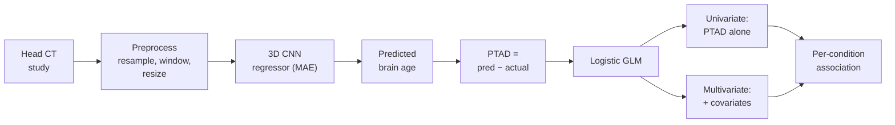

## Overview

This is a two-stage medical imaging project from the UCSF Sohn Lab. Stage one trains a custom 3D convolutional neural network to read non-contrast head CT and estimate a patient's brain age in years. Stage two takes the gap between that estimate and the patient's real age, which we call the perceived-to-actual age discrepancy (PTAD), and tests whether that single number predicts systemic disease.

The thesis is that a routine head CT carries more signal than the radiology read extracts. The perceived age of a brain on CT is one such latent signal, long described informally as tracking with a patient's medical and genetic history but historically too subjective to act on. We make it objective with a regressor, then turn the residual into a compact biomarker.

This page is both a write-up and a study guide. The top sections give a fast tour of what the system does and why CT is the interesting modality. The numbered sections go deep on each stage: the cohort, the in-house DICOM preprocessing, the 3D CNN regressor, the PTAD feature, and the logistic modeling against the disease panel. A status note at the end states plainly what is and is not reportable, since this is internal lab work with no public artifact.

<div class="row">
  <div class="col-sm mt-3 mt-md-0 text-center">
    
  </div>
</div>
<div class="caption">
  Regional segmentation experiment: a brain volume split into 8 equal regions (4 per slice via w/2 and h/2, 2 along z via z/2), comparing a proposed approach that segments first and concatenates regions along the channel dimension against a baseline that convolves over the whole volume. This figure is from a related volumetric-segmentation study. The primary model in this work is a unified 3D CNN over the preprocessed volume, not a per-region pipeline.
</div>

## What this system does

1. **Predict brain age.** A custom 3D CNN reads a preprocessed non-contrast head CT volume and outputs a single number: the brain's perceived age in years.
2. **Compute PTAD.** We subtract the patient's actual age from the predicted age. `PTAD = predicted_age − actual_age`. A positive PTAD means the brain looks older than the patient; a negative PTAD means it looks younger.
3. **Associate PTAD with disease.** PTAD becomes one per-patient feature fed into logistic GLMs, run univariate and multivariate, against a panel of systemic conditions including hypertension, diabetes, hypercholesterolemia, and polysubstance abuse.

## Why CT brain age

Brain-age models in the field are overwhelmingly built on MRI. CT-based brain age is comparatively rare, which is what makes the non-contrast CT angle here distinctive. CT is the workhorse of acute and emergency neuroimaging, so a model that runs on it sits next to scans that hospitals already acquire in volume, with no extra imaging.

The clinical bet is that perceived brain age is an extractable, data-driven biomarker. Manual or semi-quantitative readings of this signal are weak and rarely operationalized. A regressor that produces a continuous estimate, and a residual that can be regressed against disease, turns a soft radiological impression into something measurable and testable.

## Pipeline

```
DICOM head CT
  → select soft-tissue (parenchymal) reconstruction kernel, axial series
  → resample to 1 mm slice thickness
  → window normalization (emphasize brain parenchyma)
  → resize to fixed network input shape
  → custom 3D CNN regressor (2 FC layers, heavy regularization, MAE loss)
  → predicted brain age (years)
  → PTAD = predicted_age − actual_age
  → logistic GLM (logit link), univariate + multivariate
        against systemic-disease panel
  → per-condition association: hypertension, diabetes,
                               hypercholesterolemia, polysubstance abuse
```

The same flow as a diagram:



## Stack at a glance

| Layer | Technology |
| --- | --- |
| Language / numerics | Python (NumPy, SciPy) |
| Deep learning | Custom 3D CNN regressor, MAE loss, heavy regularization |
| Statistical modeling | Logistic GLM, logit link, univariate and multivariate, via scikit-learn / statsmodels |
| Medical imaging I/O | In-house DICOM preprocessing: soft-tissue axial selection, 1 mm resampling, parenchymal windowing, resize |

The write-up names only the Python numerical and statistical stack above. No deep-learning framework is recorded for this work, so none is asserted here.

---

## 1. Cohort

| Item | Value |
| --- | --- |
| Studies | 3,692 non-contrast head CT studies |
| Patients | 3,692 unique patients |
| Site | UCSF |
| Date range | March 2017 – March 2018 |
| Per-patient selection | Earliest study only when multiple exist |

One scan per patient is a deliberate choice. When a patient had multiple studies, we kept the earliest one. That minimizes contamination from post-surgical and post-hemorrhage follow-up scans, where the brain's appearance no longer reflects the patient's baseline state and would bias the perceived-age estimate.

These cohort figures come from the project's own records. They are reported here as stated, not independently verified against any external source.

## 2. Preprocessing

An in-house pipeline runs on every study before it reaches the model. Each step has a reason tied to making the volume comparable across patients and acquisition protocols.

1. **Select the soft-tissue kernel, axial series.** CT studies are reconstructed with multiple kernels. The brain-parenchyma-optimized (soft-tissue) reconstruction is the relevant series for perceiving parenchymal age, so we select it rather than the bone kernel.
2. **Resample to 1 mm slice thickness.** Acquisition protocols vary in z-spacing. Resampling to a common 1 mm thickness gives the 3D CNN consistent volumetric geometry across patients.
3. **Window normalization on brain parenchyma.** Intensity windowing targeted at parenchyma compresses the Hounsfield-unit range into the dynamic range the network needs to learn from.
4. **Resize to the fixed input shape.** A spatial resize brings every volume to the network's input dimensions.

## 3. 3D CNN brain-age regression

Stage one is a custom 3D convolutional neural network trained as a regressor over continuous age in years.

| Component | Detail |
| --- | --- |
| Model family | Custom 3D CNN regressor |
| Head | Two fully connected layers |
| Regularization | Heavy regularization throughout |
| Loss | Mean absolute error (MAE) |
| Output | Single scalar: predicted brain age in years |

The loss choice is deliberate. We train with MAE rather than MSE because the per-patient residual itself is the downstream feature. MAE training keeps the residual on the same scale as the target, in years, which is what PTAD needs to be interpretable as an age gap.

Architecture specifics beyond the table (depth, channel counts, kernel sizes, input voxel dimensions) and training specifics (optimizer, learning rate, epochs, batch size) are not recorded here, so they are not stated.

## 4. PTAD: the per-patient feature

The model output becomes a single derived feature per patient:

```
PTAD = predicted_age − actual_age
```

PTAD is signed. A positive value means the brain looks older than the patient's chronological age; a negative value means it looks younger. PTAD is the project's own term. The brain-age field describes the analogous quantity as the brain-age gap, brain predicted age difference (brain-PAD), or BrainAGE. Those are the field's equivalent concepts, included here only as synonyms for the reader's orientation.

## 5. Statistical modeling: PTAD to disease panel

Stage two regresses PTAD against systemic conditions with a generalized linear model using a logit link, that is, logistic regression. It runs in two modes.

| Mode | Predictors | Question it answers |
| --- | --- | --- |
| Univariate | PTAD alone, one model per condition | Does PTAD on its own associate with the condition? |
| Multivariate | PTAD plus other patient covariates | Does PTAD carry information independent of standard risk factors? |

Conditions in the panel include hypertension, diabetes, hypercholesterolemia, and polysubstance abuse, among others. The full disease panel beyond these named conditions is not enumerated here.

## Clinical relevance

The broader claim is that multiple data-driven imaging biomarkers can be extracted from non-contrast brain CT, as an adjunct to the routine radiological read. A deep-learning PTAD is one such biomarker: it surfaces signal that is present in the scan but not part of the standard interpretation, and it ties that signal to systemic conditions a clinician already cares about.

## Results and status

This is internal UCSF Sohn Lab work. There is no public paper, repository, or live demo, and no quantitative results are reportable here. That means no regression accuracy (MAE, RMSE, R², or correlation for the brain-age model), and no stage-two statistics (odds ratios, p-values, confidence intervals, or AUCs for the disease associations). Stating this plainly is more useful than implying metrics that cannot be shared.

## Related Sources

Background reading on brain-age methods. These describe the field, not this project's results. The project's PTAD is the same idea the literature calls the brain-age gap, brain-PAD, or BrainAGE.

- [Deep Learning for Brain Age Estimation: A Systematic Review (arXiv 2212.03868)](https://arxiv.org/pdf/2212.03868): surveys CNN and deep-learning methods for brain-age estimation and frames the brain-age gap.
- [Deep learning for brain age estimation: A systematic review (ScienceDirect)](https://www.sciencedirect.com/science/article/abs/pii/S156625352300088X): peer-reviewed systematic review, abstract-level, full text paywalled.
- [Cole et al., Predicting brain age with deep learning from raw imaging data (arXiv 1612.02572)](https://arxiv.org/pdf/1612.02572): seminal CNN brain-age-from-MRI paper reporting the gap as a reliable, heritable biomarker.
- [Predicting brain-age from raw T1-weighted MRI using 3D CNNs (arXiv 2103.11695)](https://arxiv.org/pdf/2103.11695): 3D-CNN brain-age regression, background context for the MAE scale, not this project's number.
- [Brain age gap as a predictive biomarker linking aging, lifestyle, and neuropsychiatric health (Communications Medicine)](https://www.nature.com/articles/s43856-025-01100-5): the gap associates with lifestyle and health outcomes.
- [Association of Cardiovascular Health With Brain Age (Neurology)](https://www.neurology.org/doi/10.1212/WNL.0000000000209530): links the brain-age gap to cardiovascular health, relevant to the systemic-disease idea.
- [Evaluating the Impact of Cardiometabolic Risk Factors on Neuroimaging-Based Brain Age (PMC11712361)](https://www.ncbi.nlm.nih.gov/pmc/articles/PMC11712361/): the gap associates with systolic blood pressure and cholesterol, paralleling the hypertension and hypercholesterolemia panel here.
- [Deep learning-based age estimation from chest CT scans (Springer, IJCARS)](https://link.springer.com/article/10.1007/s11548-023-02989-w): a rare CT-based age-estimation example, noting that CT-based age models are uncommon relative to MRI.
