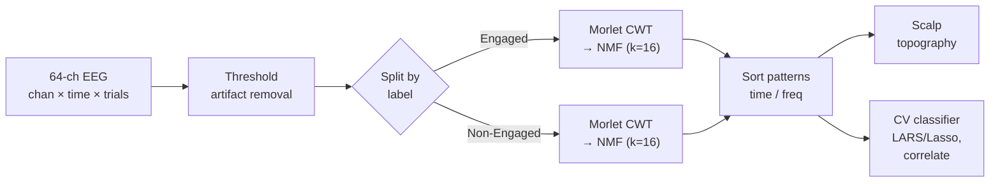

## Overview

This is internal work from the UCSF Abbasi Lab. The pipeline decodes attentional engagement from raw 64-channel EEG. It runs from per-channel time series, to time-frequency spectrograms via the Morlet wavelet transform, to non-negative matrix factorization (NMF) that breaks the spectrograms into a small set of additive pattern-and-coefficient pairs. Each pattern's coefficient vector maps back onto scalp topography, so the decomposition stays physically interpretable. The same factorization then doubles as a classifier: for a held-out trial, we solve for its coefficient vector under the frozen pattern dictionary and classify by correlation similarity to the per-class training coefficients.

The results here are preliminary. There is no public paper, code, or repository. The artifact is an internal lab slide deck, so the numbers below are the only ones reportable, and several acquisition details are not on record.

This page is both a write-up and a study guide. The top sections give a fast tour of what the pipeline does and why. The numbered sections go deep on each stage: input, preprocessing, the wavelet transform, the NMF decomposition, scalp-topography analysis, the cross-validated classifier, the results, and the planned follow-ups.

<div class="row">
  <div class="col-sm mt-3 mt-md-0 text-center">
    
  </div>
</div>
<div class="caption">
  NMF coefficient analysis. The Engaged and Non-Engaged classes side by side: per-class W-coefficient heat strips on the left, and each class's 16 per-pattern scalp topographs (P1 through P16) on the right. This single slide carries the full cross-class coefficient and topography comparison.
</div>

## Pipeline

```
64-channel EEG (channels × time × trials)
  → global thresholding (noise / artifact removal)
  → trial-label split: Engaged vs. Non-Engaged
  → per-trial, per-channel Morlet wavelet transform → time-frequency spectrograms
  → per-class NMF:  X  ≈  W · H   (additive, non-negative)
        H = principal patterns  (17758 × 16: time × frequency × channel features)
        W = coefficients per trial  (16 × 128)
  → coefficient sorting by time / frequency
  → coefficient → scalp topography mapping (per-pattern, per-class)
  → cross-validated classification:
        train  →  factorize X_train into (W_train, H_train)
        test   →  solve W' from (X_test, H_train) under non-negativity (LARS / Lasso)
        score  →  correlation between W' and W_train per class, classify by higher correlation
```

The same flow as a diagram:



<div class="row">
  <div class="col-sm mt-3 mt-md-0 text-center">
    
  </div>
</div>
<div class="caption">
  Current pipeline. Preprocessing: global thresholding for noise removal, Engaged / Non-Engaged trial split, Morlet wavelet transform to spectrograms. Decomposition: NMF applied per class. Interpretation: pattern sorting by time and frequency, scalp-topography visualization, and correlation-based classification.
</div>

## Stack at a glance

| Layer               | Technology                                                                        |
| ------------------- | --------------------------------------------------------------------------------- |
| Language / numerics | Python (NumPy, SciPy, scikit-learn)                                               |
| Time-frequency      | Morlet continuous wavelet transform, per channel per trial                        |
| Decomposition       | Non-negative matrix factorization, rank `k = 16`, applied per class               |
| Test-time coding    | LARS / Lasso under a non-negativity constraint (`spams` reference implementation) |
| Visualization       | Per-pattern scalp topography from 64-electrode coefficient vectors                |

## 1. Input: 64-channel EEG

- **Signal:** a 3D tensor `channels × time × trials`.
- **Acquisition:** 64-channel EEG, time-locked to trial onset.
- **Labels:** Engaged vs. Non-Engaged per trial. The dataset is strongly imbalanced toward Engaged trials.
- **Auxiliary target:** per-trial response time, available as a secondary regression target.

The subject count, trial counts per class, the exact imbalance ratio, the sampling rate, the electrode montage, and the task paradigm are not on record in the deck, so this page does not state them.

<div class="row">
  <div class="col-sm mt-3 mt-md-0 text-center">
    
  </div>
</div>
<div class="caption">
  Data summary: 64-channel EEG, trial-aligned, with binary engagement labels and per-trial response-time metadata.
</div>

## 2. Preprocessing

A global intensity threshold removes high-amplitude artifacts (movement, electrode pop) before any time-frequency analysis. The trials then split by label into two parallel streams, Engaged and Non-Engaged, that are factorized independently. Fitting each class separately keeps the per-class structure visible in the decomposed patterns rather than washing it out under an aggregated fit.

## 3. Morlet wavelet transform

Each per-channel, per-trial time series maps to a time-frequency spectrogram through a continuous wavelet transform with a Morlet mother wavelet. The Morlet wavelet is a complex sinusoid modulated by a Gaussian envelope. The envelope width sets the joint time-frequency localization: a narrow envelope sharpens temporal events, and a wider envelope improves frequency resolution. EEG engagement signatures live across the alpha, beta, and theta bands with onsets at different latencies, so a wavelet basis fits better than a fixed-window STFT.

The exact envelope width, the number of frequencies, the frequency range, and the cycle count are not recorded in the deck, so this page does not specify them.

<div class="row">
  <div class="col-sm mt-3 mt-md-0 text-center">
    
  </div>
</div>
<div class="caption">
  Morlet wavelet: a complex sinusoid modulated by a Gaussian envelope. Time-frequency localization is set by the envelope's width parameter.
</div>

<div class="row">
  <div class="col-sm mt-3 mt-md-0 text-center">
    
  </div>
</div>
<div class="caption">
  Per-channel Morlet spectrograms for Engaged trials (top) and Non-Engaged trials (bottom), 64 channels each. The cross-class structural differences these spectrograms expose are what the NMF stage decomposes into a small basis.
</div>

## 4. Non-negative matrix factorization

The spectrograms stack into a single non-negative matrix `X` per class, factorized as

```
X  ≈  W · H,    W ≥ 0,   H ≥ 0
```

The deck reports `H` as `17758 × 16`, described as time-by-frequency-by-channel features with 16 patterns, and `W` as `16 × 128` for the per-trial coefficients. The dictionary rank is `k = 16`. The source prose describes the 16 patterns as rows while giving `H` 16 columns, and the exact orientation convention used in the deck is not on record, so the shapes appear here verbatim rather than silently re-oriented.

NMF was chosen over PCA or ICA because its additive, non-negative constraint produces parts-based decompositions that align with how power spectra physically combine. The resulting coefficient vectors read directly as how strongly each pattern expresses in a trial, which is what the downstream scalp-topography mapping needs.

| Item                   | Value                                              |
| ---------------------- | -------------------------------------------------- |
| Objective              | `X ≈ W · H` with `W ≥ 0`, `H ≥ 0`                  |
| Rank `k`               | 16 patterns per class                              |
| `H` shape (per deck)   | 17758 × 16 (time × frequency × channel features)   |
| `W` shape (per deck)   | 16 × 128 (per-trial coefficients)                  |
| Fit scope              | One factorization per class (Engaged, Non-Engaged) |
| Reconstruction quality | Average correlation 0.99 across trials             |

<div class="row">
  <div class="col-sm mt-3 mt-md-0 text-center">
    
  </div>
</div>
<div class="caption">
  NMF decomposition. The original spectrogram matrix <code>X</code> is approximated as the product of a non-negative pattern matrix <code>H</code> and a non-negative coefficient matrix <code>W</code>.
</div>

### Reconstruction fidelity

Across the dictionary, NMF reconstructions match the original spectrograms with an average correlation of 0.99 across trials. That confirms 16 patterns are enough to capture the dominant structure in the time-frequency representation.

<div class="row">
  <div class="col-sm mt-3 mt-md-0 text-center">
    
  </div>
</div>
<div class="caption">
  NMF reconstructions vs. the original Morlet spectrograms. Average reconstruction correlation across trials: 0.99.
</div>

### Patterns and coefficients

<div class="row">
  <div class="col-sm mt-3 mt-md-0 text-center">
    
  </div>
</div>
<div class="caption">
  The 16 principal patterns of the <code>H</code> matrix, sorted by dominant frequency and time signature.
</div>

The per-trial coefficient strips and the per-pattern scalp topographs for both classes appear together in the hero slide at the top of this page (`nmf_eeg_p16.png`), which shows the Engaged and Non-Engaged coefficient heat strips and their P1 through P16 topographs side by side.

## 5. Coefficient analysis (scalp topography)

The factorization produces 16 patterns per class, each with a coefficient distribution over the 64 electrodes. Plotting each pattern's coefficients in scalp coordinates produces a topography map that exposes which scalp regions express that pattern. This spatial readout is the advantage of NMF over latent decompositions whose components carry no direct spatial interpretation.

The combined cross-class view is the hero slide above: the left half holds the Engaged and Non-Engaged coefficient strips, and the right half holds each class's 16 per-pattern topographs, so the spatial differences between the two classes read off a single figure.

## 6. Cross-validated classification

The same NMF basis doubles as a classifier under 5-fold cross-validation:

1. **Train fold:** factorize the training spectrograms `X_train ≈ W_train · H_train`. `H_train` is the learned dictionary.
2. **Test fold:** given test spectrograms `X_test` and the frozen `H_train`, solve for `W'` such that `X_test ≈ W' · H_train` under a non-negativity constraint. This constrained-coefficient estimation uses LARS / Lasso.
3. **Score:** compute the correlation between `W'` and `W_train` per class to measure how well the test trial aligns with the training-set coefficient distribution. Classify by the class with the higher correlation.

The test-time step matches the dictionary-based sparse-coding mode of the SPAMS `mexLasso` solver, which finds sparse coefficients against a fixed dictionary and supports an optional non-negativity constraint. Whether that flag and any specific sparsity level were enabled in the deck is not on record, so this page describes the step only as solving under a non-negativity constraint.

## 7. Preliminary results

| Split       | Engaged Acc.    | Non-Engaged Acc. |
| ----------- | --------------- | ---------------- |
| 1           | 0.69            | 0.80             |
| 2           | 0.67            | 0.40             |
| 3           | 0.40            | 0.40             |
| 4           | 0.76            | 0.00             |
| 5           | 0.37            | 0.50             |
| **Average** | **0.58 ± 0.16** | **0.42 ± 0.25**  |

Non-Engaged accuracy is both lower and higher-variance than Engaged. That is consistent with the class imbalance in the dataset, which is dominated by Engaged trials. These are the only classification metrics on record. Reconstruction correlation (0.99) and the table above are the full set of reportable numbers.

## 8. Future work

Items flagged in the slide deck as planned follow-ups:

- **Multi-patient generalization.** Extend the per-class factorization across subjects so the learned dictionary transfers rather than being refit per recording.
- **Class-imbalance handling.** Address the engagement-dominant sampling that drags Non-Engaged accuracy down and inflates its variance, through re-sampling, weighted losses, or focal NMF objectives.
- **Stronger classifier head.** Replace the correlation-similarity decision with a regression or neural-net head trained on the `W'` features, since correlation matching is a coarse decision rule.
- **Response-time regression.** Predict the per-trial response time from the same coefficient features, reusing the dictionary as a shared representation for a second target.

## Stack

- **Language / numerics:** Python (NumPy, SciPy, scikit-learn).
- **Time-frequency:** Morlet continuous wavelet transform per channel per trial.
- **Decomposition:** non-negative matrix factorization with rank `k = 16`, applied per class.
- **Coefficient estimation at test time:** LARS / Lasso under a non-negativity constraint (`spams` reference implementation).
- **Visualization:** per-pattern scalp topography mapping from 64-electrode coefficient vectors.

## Links

📄 Internal lab work (UCSF Abbasi Lab): slide deck on file. No public paper, code, or repository.

## Related Sources

These are method-background references for the techniques used, not citations of this project, which has no public publication or repository.

- Morlet wavelet ([Wikipedia](https://en.wikipedia.org/wiki/Morlet_wavelet)): a complex exponential carrier times a Gaussian envelope, whose σ parameter trades time resolution against frequency resolution, well-suited to non-stationary signals like EEG.
- scikit-learn NMF ([`sklearn.decomposition.NMF`](https://scikit-learn.org/stable/modules/generated/sklearn.decomposition.NMF.html)): decomposes a non-negative `X ≈ W·H`, minimizing the Frobenius reconstruction error with optional L1/L2 regularization.
- SPAMS `mexLasso` ([documentation](https://thoth.inrialpes.fr/people/mairal/spams/doc_2.5/doc/html/doc_spams005.html), [source](https://github.com/getspams/spams-devel)): a fast LARS/Lasso solver for dictionary-based sparse coding, with an option (`param.pos`) to add a non-negativity constraint on the solution, matching the test-time coefficient step.
