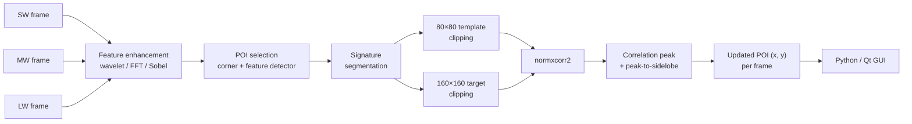

## Overview

This was my first computer vision project. At NASA JPL I worked part-time as a research assistant on PRISM, a multi-band infrared imaging effort run out of the lab's imaging and machine learning group. The problem: a sensor suite records the same aircraft simultaneously in shortwave (SW), midwave (MW), and longwave (LW) infrared, and the same object looks completely different in each band. Warm engine exhaust dominates the longwave image, reflected solar energy dominates the shortwave image, and the edges that are crisp in one band can be invisible in another. To fuse the bands or hand an analyst one coherent track, you first have to decide which pixels in the LW frame correspond to which pixels in the SW frame.

The software segments an aircraft's thermal signature automatically, selects points of interest (POIs) on it, and tracks those points across every frame of a video and across sensor bands using normalized 2-D cross-correlation. My work concentrated on the feature-enhancement filter stage that makes cross-band correlation possible at all, on a quantitative benchmark of those filters against tracking error, and on the midwave-to-longwave case at low sensor resolution, which was where the pipeline was breaking.

<div class="row mt-4">
  <div class="col-sm text-center">
    
  </div>

</div>
<div class="caption mb-4">
  <b>Figure 1.</b> A raw longwave infrared frame at 512 × 640. The airframe is a handful of warm pixels against a cluttered thermal background, and the same aircraft in the shortwave band looks nothing like this.
</div>

## Related publications

I was an undergraduate research assistant on this team and am not an author on either paper. Both describe the system I worked on, and they are the best public reference for the method:

📄 Lu T, Chao T-H, Chen K, Luong A, Dewees M, Yan X, Chow E, Torres G. **"Cross-correlation and image alignment for multi-band IR sensors."** _Proc. SPIE 9845, Optical Pattern Recognition XXVII_, 984505 (2016). DOI 10.1117/12.2224694. [SPIE](https://www.spiedigitallibrary.org/conference-proceedings-of-spie/9845/984505/Cross-correlation-and-image-alignment-for-multi-band-IR-sensors/10.1117/12.2224694.short) · [NTRS record](https://ntrs.nasa.gov/citations/20210007910)

📄 Lu T, Luong A, Heim S, Patel M, Chen K, Chao T-H, Chow E, Torres G. **"Intelligent multi-spectral IR image segmentation."** _Proc. SPIE 10203, Pattern Recognition and Tracking XXVIII_, 1020303 (2017). DOI 10.1117/12.2262730. [SPIE](https://www.spiedigitallibrary.org/conference-proceedings-of-spie/10203/1/Intelligent-multi-spectral-IR-image-segmentation/10.1117/12.2262730.short)

The 2016 paper is the cross-band alignment work described here: band-pass filtering in the Fourier domain plus Mexican Hat and Gaussian Derivative wavelets to make features look similar across bands, then cross-correlation, driven from a Python/Qt GUI. The 2017 paper is the follow-on, where a neural network is trained on features of both object and background in the LW imagery and retrained over multiple iterations until segmentation accuracy is acceptable.

## Why cross-band correlation is hard

Correlating a template against a target is easy when both come from the same camera. Here they do not. Three things break the naive approach:

1. **Radiometric mismatch.** A helicopter's rotor mast may be the brightest structure in MW and nearly absent in SW. Correlating raw intensities matches the wrong things because the intensity relationship between bands is not even monotonic.
2. **Geometric mismatch.** The sensors sit at different points on the mount with different optics, so the same object lands at a different scale, offset, and slight rotation per band.
3. **Resolution mismatch.** The bands do not share a pixel grid. Some of the collections were 512 × 640; the low-resolution MW/LW set I worked on was 257 × 320, roughly a quarter of the pixels on target.

The strategy that makes it tractable is to stop correlating intensities and start correlating _shape_. Push every band through a filter that discards absolute brightness and keeps edges and blob structure, and the filtered SW and filtered LW images of the same airframe start to look like the same picture. Everything downstream depends on picking that filter well, which is why so much of my time went into evaluating them.

## Pipeline

```
SW / MW / LW frames  →  Feature Enhancement  →  POI Selection  →  Signature Segmentation  →  Normalized 2-D  →  Per-frame POI  →  Track
                        (Mexican Hat wavelet,   (corner + feature   (segmented signature      Cross-Correlation   (x, y) update
                         FFT band-pass, Sobel,   point detector,     mask, edge outline)       (normxcorr2,
                         Gaussian, Linear)       operator picks)                               80×80 template
                                                                                              in 160×160 target)
```

The same flow as a diagram. The template is a small clipping around a POI; the target is a larger clipping from the next frame or the other band, and the correlation peak location is the tracked update.



## Stack at a glance

| Layer          | Technology                                                                                                                                                        |
| -------------- | ----------------------------------------------------------------------------------------------------------------------------------------------------------------- |
| Algorithm work | MATLAB (`normxcorr2`, `imsharpen`, `imadjust`, `histeq`, `adapthisteq`, corner and feature-point detectors)                                                       |
| Filter bank    | Mexican Hat wavelet, Gaussian Derivative wavelet, Fourier-domain band-pass, Sobel, Gaussian with L2 normalization, linear kernels for large and for faint objects |
| Correlation    | Normalized 2-D cross-correlation, 80 × 80 template against 160 × 160 target, peak-to-sidelobe scoring                                                             |
| Application    | Python + Qt desktop GUI for training, viewing, calibration, and batch processing                                                                                  |
| Data           | Co-collected SW / MW / LW infrared video of fixed- and rotary-wing aircraft at 512 × 640 and 257 × 320                                                            |
| Analysis       | Per-POI tracking-error curves, 3D correlation-surface plots, contour planes, per-filter benchmark over 612 frames                                                 |

---

## 1. Feature Enhancement Filters

The filter bank is the part of the system that makes two different physical measurements comparable. Each filter trades away different information:

- **Mexican Hat wavelet** (the Laplacian of a Gaussian). A rotationally symmetric band-pass that responds to blobs at a chosen scale. It was the default on shortwave, where the airframe reads as a compact bright blob against sky.
- **Fourier-domain band-pass.** Cuts the low-frequency thermal gradient (sky, terrain, sensor shading) and the high-frequency sensor noise, leaving the mid-frequency band where airframe structure lives. This was the default on longwave, where a broad warm background otherwise dominates.
- **Gaussian derivative with L2 normalization.** Smooths, then differentiates, then normalizes energy, which suppresses the absolute-brightness difference between bands. This is the filter that boldens an outline most reliably on well-exposed targets.
- **Sobel.** A cheap directional gradient. It keeps sharp, elongated, thin structure (rotor blades, wings, tail booms) and throws away smooth gradients, which turns out to matter enormously in cloud.
- **Linear kernels** tuned separately for large objects and for faint objects, used when the target fills the frame or nearly vanishes into the background.

The choice is not cosmetic. A filter that is right for the band and the scene produces a correlation surface with one sharp peak; a filter that is wrong produces a broad, ambiguous surface, and the tracked point walks off the aircraft within twenty frames.

<div class="row mt-4">
  <div class="col-sm text-center">
    
  </div>

</div>
<div class="caption mb-4">
  <b>Figure 2.</b> The same frame in all three bands after wavelet enhancement: shortwave target, midwave template, longwave target, with the four tracked POIs in green. Absolute brightness is gone and the airframe outline survives in all three, which is what makes cross-band correlation possible.
</div>

## 2. POI Selection and Signature Segmentation

Once filtered, the algorithm runs a corner and feature-point detector over the enhanced image and segments the aircraft's thermal signature from the background. The segmentation gives the outline; the detector gives candidate points on it. An operator selects the POIs to track (typically four, spread across the airframe so that a single occlusion does not kill the whole track), and from that point on each POI is tracked independently.

<div class="row mt-4">
  <div class="col-sm text-center">
    
  </div>

</div>
<div class="caption mb-4">
  <b>Figure 3.</b> Two frames of the same aircraft under different background conditions. Left: the input frame. Middle: corner detections. Right: the surviving feature points with their scales. The bottom row's warmer background produces detections on the airframe alone, which is the behavior the enhancement stage is tuned for.
</div>

Tracking each POI independently is what makes the system diagnosable. When one point drifts and three hold, that is an occlusion or an aspect change on one part of the airframe. When all four drift together, the filter choice or the segmentation is wrong.

## 3. Normalized 2-D Cross-Correlation

Around each POI, an 80 × 80 pixel clipping becomes the **template**. In the next frame, or in the other band's image, a 160 × 160 clipping around the predicted location becomes the **target**. Normalized cross-correlation (`normxcorr2`) slides the template over the target and produces a correlation surface; the peak location is the POI's new position.

<div class="row mt-4">
  <div class="col-sm-6 text-center">
    
  </div>

  <div class="col-sm-6 text-center mt-3 mt-sm-0">
    
  </div>

</div>
<div class="caption mb-4">
  <b>Figure 4.</b> Left: the 160 × 160 target clipping searched for a match. Right: the 80 × 80 template clipping cut around a POI. Both are shown after enhancement, which is the form correlation actually operates on.
</div>

Normalization is the load-bearing detail. Plain correlation scores a bright region highly for being bright. Normalizing by local mean and standard deviation makes the score depend on the _pattern_ rather than the level, which is exactly what you need when the same object is 40% dimmer in the other band.

The quality of a match is read off the surface itself. A tall, narrow peak sitting well above the surrounding sidelobes is a confident match. A low peak, or a peak barely above its neighbors, means the match is ambiguous, and **peak-to-sidelobe ratio** is the scalar that captures this. I built 3D surface plots and contour planes of the correlation output for exactly this reason: they turn a track failure into something visible, since you can see the peak flatten a frame or two before the point actually jumps.

<div class="row mt-4">
  <div class="col-sm text-center">
    
  </div>

</div>
<div class="caption mb-4">
  <b>Figure 5.</b> Correlation surfaces for four POIs on one aircraft (head, left wing, left tail, right tail), plotted against the filtered LW target and filtered SW template. A confident match is a single tall ridge; the noisy, multi-ridge surfaces are the points about to lose track.
</div>

Below is the tracker running across a 49-frame sequence with wavelet enhancement, correlating shortwave, midwave, and longwave simultaneously. The four green POIs hold position on the airframe in all three bands as the aircraft moves through the frame.

<div class="row mt-4">
  <div class="col-sm text-center">
    <video controls playsinline preload="auto" class="rounded z-depth-1" style="width: 100%; max-width: 100%; height: auto;">
      <source src="{{ '/assets/video/projects/jpl_wavelet_self_correlation.mp4' | relative_url }}" type="video/mp4">
      Your browser does not support embedded video. <a href="{{ '/assets/video/projects/jpl_wavelet_self_correlation.mp4' | relative_url }}">Download the clip</a>.
    </video>
  </div>

</div>
<div class="caption mb-4">
  <b>Video 1.</b> Wavelet self-correlation across SW, MW, and LW over 49 frames. Each green marker is one independently tracked POI.
</div>

## 4. The Midwave-to-Longwave Low-Resolution Case

The pipeline was tuned on 512 × 640 collections. My main assignment was a new MW/LW set at **257 × 320**, and on that data it broke in four visible ways:

1. The geometric transformation between the bands came out skewed.
2. Filtering was mismatched between the two bands, so the filtered pair no longer resembled each other and correlation had nothing to lock onto.
3. Correlation results were simply wrong: peaks landed off the airframe.
4. The POI clipping window exceeded the image bounds near frame edges, which shrank the working image, and the tracked coordinates then froze at identical values across every frame. A track that never moves looks stable at a glance and is actually dead.

<div class="row mt-4">
  <div class="col-sm-6 text-center">
    
  </div>

  <div class="col-sm-6 text-center mt-3 mt-sm-0">
    
  </div>

</div>
<div class="caption mb-4">
  <b>Figure 6.</b> The resolution drop that broke the pipeline. Left: the 512 × 640 collections the filters were tuned on. Right: the 257 × 320 MW/LW set, roughly a quarter of the pixels on target.
</div>

<div class="row mt-4">
  <div class="col-sm text-center">
    
  </div>

</div>
<div class="caption mb-4">
  <b>Figure 7.</b> Initial results on the low-resolution set. The SW template (right) comes out skewed by the geometric transformation, filtering has stripped the airframe rather than enhanced it, and the red POIs on the LW target sit off the aircraft entirely.
</div>

The root cause was that the filter defaults were tied to the old pixel scale. The Mexican Hat wavelet on shortwave and the FFT band-pass on longwave are both scale-dependent: their pass bands were tuned for a target spanning a few hundred pixels, and at roughly a quarter of the pixels on target, they were band-passing structure that no longer existed. They were removing the aircraft and keeping noise.

The fix was three changes:

- **Add an image-enhancement stage** in place of the mistuned band-pass: `imsharpen` for edge acutance, `imadjust` for range stretching, `histeq` for global contrast, and `adapthisteq` for local (CLAHE-style) contrast. At low resolution the useful signal is a small number of low-contrast pixels, so recovering local contrast beats band-passing.
- **Increase clipping size**, moving template and target windows to 41 × 41 and 81 × 81 arrays so that each window still covers a meaningful portion of a now-smaller target and stays inside the frame.
- **Remove the inherited SW and LW filter calls** rather than retune them, then reintroduce enhancement selectively.

After those changes, correlation locked on, and the POI coordinates tracked the airframe across frames instead of freezing.

<div class="row mt-4">
  <div class="col-sm-6 text-center">
    
  </div>

  <div class="col-sm-6 text-center mt-3 mt-sm-0">
    
  </div>

</div>
<div class="caption mb-4">
  <b>Figure 8.</b> The shortwave template before (left) and after (right) the fix. The skew and the black transformation wedge are gone, contrast recovers the airframe, and the POIs land on the fuselage and skids.
</div>

Sobel filtering was then added back on top as an edge-detection and enhancement pass, along with the corner and feature-point detector, which sharpened the correlation peak further.

<div class="row mt-4">
  <div class="col-sm text-center">
    
  </div>

</div>
<div class="caption mb-4">
  <b>Figure 9.</b> Final result on the 257 × 320 MW/LW set. Four POIs on the LW target (red) matched against the same four on the SW template (green), with the airframe outline clean enough in both bands to correlate.
</div>

<div class="row mt-4">
  <div class="col-sm text-center">
    
  </div>

</div>
<div class="caption mb-4">
  <b>Figure 10.</b> A cross-band POI match on a different aspect. The five red points on the filtered LW target correspond one-to-one with the five green points on the filtered SW template.
</div>

The end-of-project write-up recommended three next steps: overlay all three wavelengths at once, improve edge clarity across all three image types, and improve the sharpness and smoothness of the correlation peak.

## 5. Quantitative Filter Benchmark

The filter choice was being made by eye, so in March 2016 I ran a quantitative comparison. Four representative videos (cases 7, 35, 60, and 26) covering different target sizes and background conditions, five filters each, four POIs per video, tracking error measured per POI per frame in pixels against the correct position, then averaged across **612 frames** in total.

Average tracking error in pixels, per video, per filter (lower is better):

| Video    | Sobel    | Wavelet | Wavelet + Sobel | Gaussian | Linear |
| -------- | -------- | ------- | --------------- | -------- | ------ |
| Video 7  | 8.63     | 9.02    | 9.96            | 8.99     | 9.15   |
| Video 35 | **1.56** | 5.79    | 2.84            | 16.13    | 1.63   |
| Video 60 | **1.56** | 5.38    | 3.43            | 7.18     | 7.12   |
| Video 26 | 3.72     | 3.53    | 4.30            | 4.24     | 3.91   |

<div class="row mt-4">
  <div class="col-sm text-center">
    
  </div>

</div>
<div class="caption mb-4">
  <b>Figure 11.</b> Average tracking error per video, per filter. Video 7 separates nothing; video 35 separates everything, with Gaussian at 16.1 px against Sobel at 1.6 px.
</div>

Averaged across all 612 frames:

| Filter          | Avg tracking error (px) |
| --------------- | ----------------------- |
| **Sobel**       | **4.40**                |
| Linear          | 5.13                    |
| Wavelet + Sobel | 5.45                    |
| Wavelet         | 5.93                    |
| Gaussian        | 9.13                    |

<div class="row mt-4">
  <div class="col-sm text-center">
    
  </div>

</div>
<div class="caption mb-4">
  <b>Figure 12.</b> Mean tracking error per filter across all 612 frames. Sobel is the best single default at 4.40 px; Gaussian, the filter that produces the most attractive output images, is the worst at 9.13 px.
</div>

Three things worth pulling out of this table.

**Sobel wins on average, and the margin comes from the hard cases.** On video 7 every filter lands between 8.6 and 10.0, so the choice barely matters. On videos 35 and 60 Sobel sits at 1.56 px while Gaussian is at 16.13 and 7.18. The aggregate ranking is decided almost entirely by scenes where most filters fail, which is the useful thing to know when you are picking a default.

**Gaussian's failure is a variance problem.** Gaussian is competitive on video 7 (8.99) and video 26 (4.24), then catastrophic on video 35 (16.13). It smooths before it differentiates, so when the background carries structure at a similar scale to the target, it boldens background and target alike and the correlation peak is no longer unique.

**Combining filters is not free.** Wavelet + Sobel is worse than Sobel alone on every single video. Each filter discards information; chaining them discards the union, and the second filter is often operating on an image whose statistics the first one already destroyed.

The tracking-error curves show _how_ a filter fails, not only how much. A failing POI's error stays near zero for the first twenty frames and then climbs a ramp to 250 or 300 pixels and plateaus, which is the signature of the template locking onto background structure and following that instead. The plateau is where the point hits the image edge. A working POI stays flat in the single digits for the entire sequence. The failure is not a gradual accumulation of noise; it is one bad frame, after which the track is lost for good.

<div class="row mt-4">
  <div class="col-sm text-center">
    
  </div>

</div>
<div class="caption mb-4">
  <b>Figure 13.</b> Per-POI tracking error against frame number in the shortwave band, x and y separately, one line per POI. Two POIs hold in the single digits for all 51 frames; two break loose around frame 20 and ramp to 300 px in x and 165 px in y before flattening at the image edge.
</div>

## 6. Filter Selection Guide

The benchmark says Sobel is the best single default. Operators, though, do not run a single default: they see a case, and they need to pick. So in May 2016 I turned the accumulated behavior into a per-case guide, organized by what an analyst can see on screen before choosing anything.

| Case                 | First choice          | Fallback                              | Reasoning                                                                                                                                                        |
| -------------------- | --------------------- | ------------------------------------- | ---------------------------------------------------------------------------------------------------------------------------------------------------------------- |
| Small aircraft       | Gaussian (L2 norm.)   | Sobel                                 | Gaussian outlines and boldens the few pixels on target; Sobel's outline is thin and skips parts of the airframe                                                  |
| Medium aircraft      | Gaussian (L2 norm.)   | Sobel                                 | Gaussian when the scene is clean and the target is a single distinguishable color; Sobel when features are sharp, elongated, thin, patchy, or carry bright spots |
| Large aircraft       | Gaussian (L2 norm.)   | Sobel, or linear (large object)       | With many pixels on target, feature points and outlines are easy to hold; the fallbacks miss features around the airframe                                        |
| Cloudy               | **Sobel**             | Low-pass smoothing + L2 normalization | Sobel removes cloud outright while still tracking features; smoothing first keeps Gaussian from boldening the cloud, though it clears less of it                 |
| Faint / dark         | Linear (faint object) | Gaussian (L2 norm.)                   | The darker the feature, the better the faint-object kernel works; Gaussian once the scene is faint but not dark                                                  |
| Color / level change | Linear (faint object) | Gaussian (L2 norm.)                   | Behaves like the faint case, since what changes is the level rather than the structure                                                                           |

<div class="row mt-4">
  <div class="col-sm-6 text-center">
    
  </div>

  <div class="col-sm-6 text-center mt-3 mt-sm-0">
    
  </div>

</div>
<div class="caption mb-4">
  <b>Figure 14.</b> The cloudy case. Left: raw, with the aircraft embedded in bright cloud that carries structure at the same scale as the airframe. Right: after Sobel, the cloud is gone and the outline, rotor, and skids survive. This is the one case where Sobel is the first choice rather than the fallback.
</div>

<div class="row mt-4">
  <div class="col-sm-6 text-center">
    
  </div>

  <div class="col-sm-6 text-center mt-3 mt-sm-0">
    
  </div>

</div>
<div class="caption mb-4">
  <b>Figure 15.</b> The faint/dark case. Left: a fixed-wing target where everything but the engine exhaust sits near the noise floor. Right: a faint target after filtering, with the tree line and cloud banding recovered alongside the aircraft, which is exactly the clutter the faint-object linear kernel is meant to keep out of the correlation window.
</div>

The guide and the benchmark disagree, and the disagreement is the point. Per-case, Gaussian is the recommendation for most clean aircraft imagery because it produces the boldest, most complete outline when the background is cooperative. In aggregate, Gaussian is the worst filter in the bank because the cases where it fails (structured cloud, cluttered background) it fails badly, while Sobel is mediocre-but-stable everywhere. Which number you should act on depends on whether an operator is watching. With a human in the loop who can identify the case, use the per-case guide. Running unattended, use Sobel.

## 7. Operator GUI

The algorithm shipped inside a Windows desktop application written in **Python and Qt** that encompassed training, viewing, and every function of the pipeline. Analysts used it to load multi-band video, run processing and calibration, select POIs, step through tracked frames, and organize results. The 2016 SPIE paper describes this GUI as the vehicle for the whole cross-correlation workflow.

The reason it mattered: this pipeline has a lot of knobs (filter choice, clipping sizes, POI placement, enhancement settings) and the right setting is scene-dependent. Without a GUI, evaluating a filter meant editing a script and re-running a batch. With one, an analyst could see a bad correlation peak and change the filter in the same minute.

## Related Sources

- [Cross-correlation and image alignment for multi-band IR sensors](https://www.spiedigitallibrary.org/conference-proceedings-of-spie/9845/984505/Cross-correlation-and-image-alignment-for-multi-band-IR-sensors/10.1117/12.2224694.short) (SPIE 9845, 2016): the team publication describing this alignment pipeline and GUI.
- [Intelligent multi-spectral IR image segmentation](https://www.spiedigitallibrary.org/conference-proceedings-of-spie/10203/1/Intelligent-multi-spectral-IR-image-segmentation/10.1117/12.2262730.short) (SPIE 10203, 2017): the follow-on that replaces hand-tuned segmentation with a trained neural network on LW object and background features.
- [NTRS record 20210007910](https://ntrs.nasa.gov/citations/20210007910): NASA Technical Reports Server entry for the 2016 paper.
- `normxcorr2` (Lewis 1995, "Fast Normalized Cross-Correlation"): the normalized correlation formulation used for template matching.
- Mexican Hat wavelet / Laplacian of Gaussian: the scale-selective band-pass used for shortwave feature enhancement.
- Peak-to-sidelobe ratio: the correlation-confidence measure used to score match quality.
